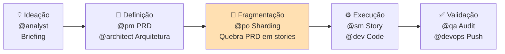
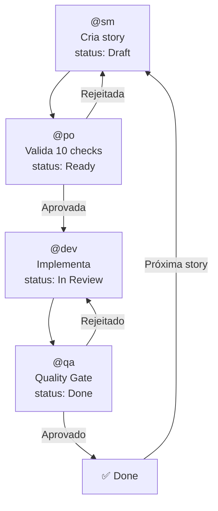
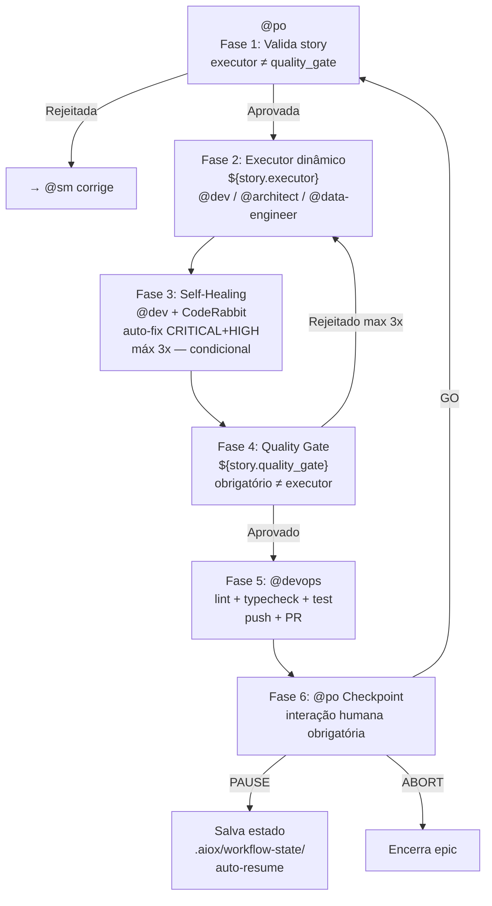
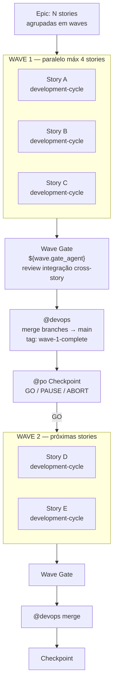
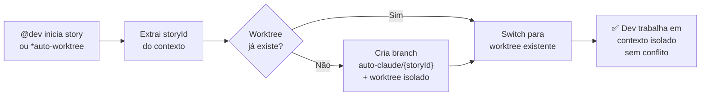
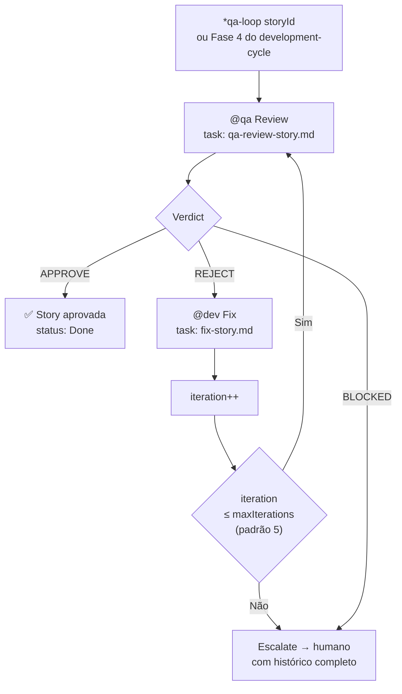
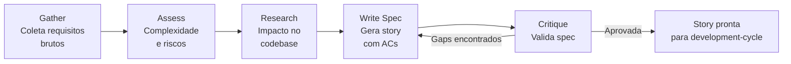
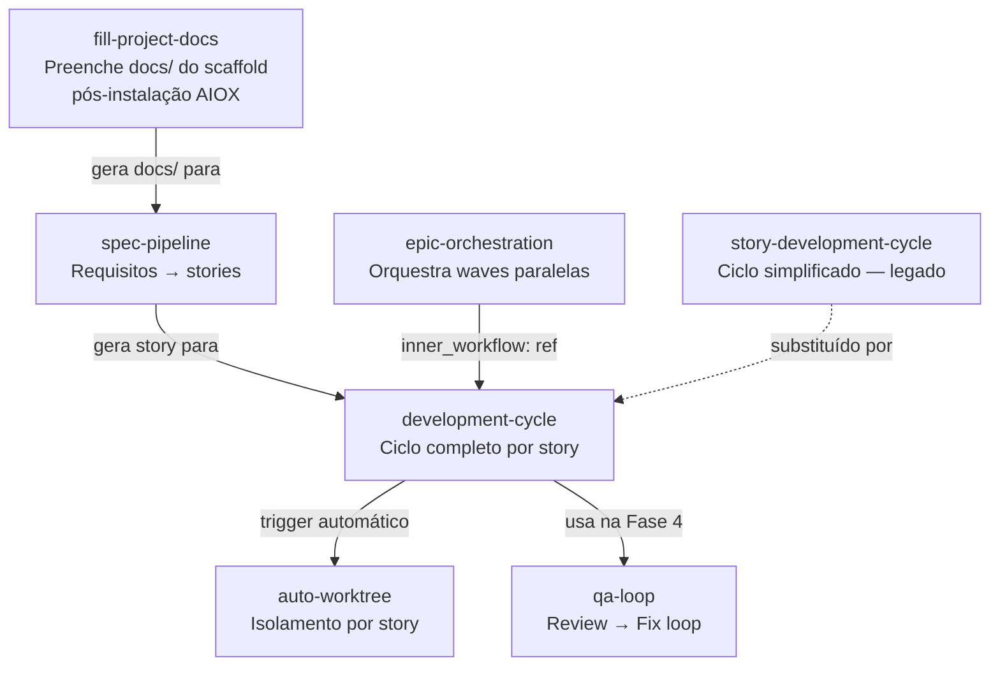

# AIOX Manual

Manual de referência dos conceitos do Synkra AIOX. Estudo pessoal baseado no repositório original [SynkraAI/aiox-core](https://github.com/SynkraAI/aiox-core), do qual este é um fork de aprendizado com adições próprias (módulo Pro, squads mmos-squad, squad-creator, claude-code-mastery).

---

## Índice

1. [Visão geral](#visão-geral)
2. [Conceitos](#conceitos) — Agent, Squad, Workflow, Task, Story, Constitution, Gate, Template, Checklist, Handoff, Flow-state, Execution profile, IDS
3. [Elementos e estruturas](#parte-2--elementos-e-estruturas) — Arquitetura, diretórios, onde criar cada artefato, squad.yaml, Runtime (.aiox/), CLI
4. [Módulo Pro e Squads](#módulo-pro-e-squads) — pro/, os três squads Pro, scaffolder, teste local
5. [Configuração e funcionamento](#parte-5--configuração-e-funcionamento) — Camadas L1→L5, core-config, pro-config, feature-registry, config-resolver, ideSync, como o modelo enxerga o framework (3 mecanismos), boundary, Agente AIOX vs Agente autônomo
6. [Workflows de desenvolvimento](#parte-6--workflows-de-desenvolvimento) — Linha de montagem, fill-project-docs, story-development-cycle, development-cycle, epic-orchestration, auto-worktree, qa-loop, spec-pipeline
7. [Cadeia de granularidade](#parte-7--cadeia-de-granularidade) — PRD → Épico → Story → Spec → Tasks → Subtasks, breakdown concreto, regras de ouro
8. [Documentos de arquitetura e padrões](#parte-8--documentos-de-arquitetura-e-padrões) — docs/framework/, docs/architecture/, ADRs, fill-project-docs (popular scaffold), technical-preferences, mapa de responsabilidade
9. [Guia de comandos e utilizações práticas](#parte-9--guia-de-comandos-e-utilizações-práticas) — **Referência rápida (9.0)**, como ativar agentes, comandos universais, comandos por agente, roteiros de uso (novo projeto, brownfield, story, QA, DevOps, banco de dados, **fluxo completo com workflows**, diagnóstico de saúde, validar instalação)

---

## Visão geral

O AIOX é um framework de agentes de IA baseado em arquivos `.md` e `.yml`/`.yaml`. Sozinho ele não executa nada: é obrigatório usar uma ferramenta de IA (Claude Code, Cursor, Codex, Gemini CLI, etc.) que leia o AIOX e atue como motor de execução. Todo o conteúdo é linguagem natural, orientando o LLM a executar necessidades (tasks, workflows, agentes, squads). O modo de funcionamento varia por IDE: em algumas há suporte a cron e agente autônomo; em outras pode ser necessário um servidor (ex.: Node) que dispare jobs e passe o contexto AIOX ao LLM.

---

## Conceitos

### Agent (agente)

Agente é um arquivo `.md` que define um persona de IA: **skills** (capacidades), **personalidade** (persona, tone, vocabulary, greeting), e referências a **checklists** e outros artefatos. Na estrutura oficial do AIOX o agente inclui ainda:

- **Identificação**: `name`, `id`, `title`, `icon`, `whenToUse`, `customization`
- **Commands**: lista de comandos (ex.: `*develop`, `*help`) com descrição e visibilidade
- **Dependencies**: referências a tasks, templates, checklists, workflows, scripts, data, tools (os checklists ficam em arquivos separados, referenciados aqui)
- **Activation instructions**: passos que a IA segue ao ser ativada (adotar persona, exibir greeting, aguardar input)
- **IDE-FILE-RESOLUTION** e **REQUEST-RESOLUTION**: como resolver paths e mapear pedidos do usuário a comandos

---

### Squad

Squad é um **pacote modular** que reúne um conjunto de **agentes** e um **workflow** (além de tasks, config, templates, tools) para um domínio ou caso de uso. Não é um único arquivo: é uma pasta com `squad.yaml` (manifesto obrigatório), `agents/`, `tasks/`, `workflows/`, `config/`, `templates/`, etc. A arquitetura é **task-first**: as tasks são o ponto de entrada de execução; os agentes orquestram as tasks.

---

### Workflow

Workflow é um **processo** que descreve sequência de passos, envolvendo tasks e agentes. Pode ser documentado em **Markdown** (guias de fluxo) ou definido em **YAML** (estrutura com `id`, `name`, `type` sequential/parallel/conditional, `steps`, `triggers`, `inputs`).

---

### Task

Task é a **definição de uma atividade** com **input**, **processamento** e **output**. No AIOX segue o TASK-FORMAT-SPECIFICATION-V1 e inclui ainda:

- **Responsável** (agente/worker/humano) e **atomic_layer** (Atom, Molecule, Organism, etc.)
- **Checklist** da task: pre-conditions, post-conditions, acceptance-criteria (com blocker, validação, story)
- Opcionais: Template, Tools, Scripts, Performance (duration, cost, cache, parallelizable), Error Handling, Metadata (story, version, dependencies)

---

### Story

Unidade de desenvolvimento. Arquivo em `docs/stories/` (ex.: `story-6.1.2.5.md`) com acceptance criteria, tasks/subtasks, checkboxes de progresso, File List e status (Draft → Ready for Review → Done). Nenhum código é escrito sem story associada (princípio Story-Driven Development da Constitution).

---

### Constitution

Princípios inegociáveis do AIOX (`.aiox-core/constitution.md`): CLI First, Agent Authority, Story-Driven Development, No Invention, Quality First, Absolute Imports. Violações são tratadas por **gates** (bloqueio ou alerta).

---

### Gate

Ponto de verificação automático. Comportamento: **BLOCK** (impede execução), **WARN** (alerta e segue) ou **INFO** (apenas informa). Ex.: falta de story válida pode bloquear; falha em lint/typecheck/test no pre-push bloqueia merge.

---

### Template

Arquivo modelo (ex.: `prd-tmpl.md`, `story-tmpl.yaml`, `workflow-template.yaml`) usado por tasks ou agentes para gerar artefatos. Local comum: `.aiox-core/product/templates/` ou dentro de squads.

---

### Checklist

Lista de verificação (pre/post conditions, acceptance). Pode ser um arquivo `.md` (ex.: `story-dod-checklist.md`) referenciado nas **dependencies** do agente, ou uma seção dentro do formato da própria task.

---

### Handoff

Passagem de contexto entre agentes. Artefatos em `.aiox/handoffs/` (YAML com `from_agent`, `last_command`, `consumed`). O próximo agente usa isso para sugerir o comando seguinte.

---

### Flow-state

Estado em tempo de execução da progressão do workflow e da próxima ação (termo oficial no glossary do AIOX).

---

### Execution profile

Perfil de autonomia do agente (ex.: safe, balanced, aggressive), definindo quanto o agente pode fazer sem confirmação do usuário (substitui o antigo “permission mode” na documentação).

---

### IDS (Incremental Development System)

Conjunto de processos e ferramentas que levam o agente a consultar antes de criar: hierarquia **REUSE > ADAPT > CREATE**, uso de Entity Registry, Verification Gates e self-healing. Reduz duplicação e invenção desnecessária.

---

## Resumo

| Conceito            | Definição resumida |
|---------------------|--------------------|
| **AIOX**            | Framework de instruções em linguagem natural (.md/.yml) executado por uma IA (IDE/CLI). |
| **Agent**           | Persona + commands + dependencies (tasks, templates, checklists) + activation. |
| **Task**            | Unidade executável com entrada, saída, responsável, checklist e opcionais (template, scripts, performance). |
| **Workflow**        | Orquestração de passos (documentada em .md ou definida em .yaml). |
| **Squad**           | Pacote (squad.yaml + agents/, tasks/, workflows/, config/, templates/) para um domínio. |
| **Story**           | Unidade de desenvolvimento em docs/stories/; obrigatória para escrever código. |
| **Constitution**    | Princípios inegociáveis; gates aplicam. |
| **Gate**            | Verificação automática (BLOCK / WARN / INFO). |
| **Template**        | Modelo para geração de artefatos. |
| **Checklist**       | Lista de verificação (arquivo ou seção em task). |
| **Handoff**         | Passagem de contexto entre agentes (.aiox/handoffs/). |
| **Flow-state**      | Estado atual do workflow. |
| **Execution profile** | Nível de autonomia do agente. |
| **IDS**             | REUSE > ADAPT > CREATE + Entity Registry + Gates + self-healing. |

---

# Parte 2 — Elementos e estruturas

Onde cada conceito vive no disco: diretórios, convenções de nome e formato dos arquivos.

---

## Arquitetura modular

Dois níveis principais:

1. **Framework core** (`.aiox-core/`) — componentes portáveis do framework, organizados por domínio.
2. **Workspace do projeto** (raiz) — código e documentação do projeto.

Diretórios em **kebab-case** (minúsculas, hífen). Arquivos de código e docs em **kebab-case** com extensão; config em minúsculas ou kebab-case (ex.: `package.json`, `core-config.yaml`).

---

## Estrutura principal (raiz)

```
aiox-core/
├── .aiox-core/           # Framework (agents, tasks, workflows, product, etc.)
├── docs/                  # Documentação pública (stories, guides, architecture)
├── squads/                # Squads instalados (cada um é uma subpasta)
├── .aiox/                 # Estado de runtime (status, patterns, handoffs, worktrees)
├── bin/                   # CLI (ex.: aiox.js)
├── templates/             # Template de squad para criar novos
├── tests/                 # Testes (unit, integration, e2e)
├── .claude/               # Config Claude Code (CLAUDE.md, commands, rules)
├── .codex/                # Config Codex CLI (skills, agents)
├── .gemini/               # Config Gemini CLI (rules, commands)
├── .cursor/               # Config Cursor (rules/*.mdc, agents/, skills/)
├── .windsurf/             # Config Windsurf (rules/) — suporte Pro
├── .antigravity/          # Config AntiGravity (agents/) — suporte Pro
├── package.json
└── README.md
```

---

## Framework core (`.aiox-core/`)

```
.aiox-core/
├── constitution.md        # Princípios inegociáveis
├── core-config.yaml       # Configuração do framework
├── development/           # Ativos de desenvolvimento
│   ├── agents/            # Definições de agentes (*.md)
│   ├── tasks/             # Tasks (*.md)
│   ├── workflows/         # Workflows (*.yaml)
│   ├── templates/         # Templates de desenvolvimento
│   └── scripts/           # Scripts de desenvolvimento
├── product/               # Ativos PM/PO
│   ├── templates/         # Templates de documento (prd, story, epic)
│   ├── checklists/        # Checklists de validação (*.md)
│   └── data/              # Dados de produto (referências)
├── data/                  # Dados compartilhados (aiox-kb, workflow-patterns, etc.)
├── cli/                   # Comandos e utilitários da CLI
├── core/                  # Essenciais (config, session, quality-gates, etc.)
├── infrastructure/        # Integrações, scripts de infra, templates CI
├── quality/               # Schemas de quality gates
├── schemas/               # JSON Schema (agent-v3, task-v3, squad)
└── docs/standards/        # Padrões internos (TASK-FORMAT-SPEC, AGENT-PERSONALIZATION)
```

---

## Onde fica cada tipo de artefato

| Artefato   | Localização                                      | Formato / Nome |
|-----------|---------------------------------------------------|----------------|
| **Agent** | `.aiox-core/development/agents/`                   | `{agent-name}.md` (kebab-case). Markdown com bloco YAML. |
| **Task**  | `.aiox-core/development/tasks/`                    | `{task-name}.md` (kebab-case). Markdown (workflow). |
| **Workflow** | `.aiox-core/development/workflows/`            | `{workflow-type}-{scope}.yaml`. YAML. |
| **Template** | `.aiox-core/product/templates/`                 | `{name}-tmpl.{yaml|md}`. Ex.: `story-tmpl.yaml`, `prd-tmpl.md`. |
| **Checklist** | `.aiox-core/product/checklists/`               | `{name}-checklist.md`. Markdown. |
| **Story** | `docs/stories/{contexto}/`                         | `story-{epic}.{story}.{substory}.md` ou similar. Markdown. |
| **Epic**  | `docs/epics/` ou contexto em `docs/stories/`      | `epic-{number}-{name}.md`. |
| **Constitution** | `.aiox-core/constitution.md`                  | Um único arquivo. |
| **Squad** | `squads/{squad-name}/`                            | Pasta com `squad.yaml` + subpastas (ver abaixo). |

---

## Convenções de nome (casos especiais)

| Tipo       | Padrão de nome                          | Exemplo |
|------------|------------------------------------------|---------|
| Stories    | `story-{epic}.{story}.{substory}.md`     | `story-6.1.2.5.md` |
| Epics      | `epic-{number}-{name}.md`                | `epic-6.1-agent-identity-system.md` |
| Decisões   | `decision-{number}-{name}.md`             | `decision-005-repository-restructuring-FINAL.md` |
| Templates  | `{name}-tmpl.{yaml|md}`                  | `story-tmpl.yaml`, `prd-tmpl.md` |
| Checklists | `{name}-checklist.md`                    | `architect-checklist.md`, `story-dod-checklist.md` |

---

## Estrutura de um Squad

Cada squad é uma pasta em `squads/{squad-name}/`:

```
squads/my-squad/
├── squad.yaml              # Manifesto (obrigatório): name, version, description, components
├── README.md
├── LICENSE
├── config/
│   ├── coding-standards.md
│   ├── tech-stack.md
│   └── source-tree.md
├── agents/                  # Agentes do squad (*.md ou *.yaml)
├── tasks/                   # Tasks do squad (*.md)
├── workflows/               # Workflows (*.yaml)
├── checklists/              # Opcional
├── templates/               # Opcional
├── tools/                   # Opcional
├── scripts/                 # Opcional
└── data/                    # Opcional
```

**squad.yaml** (resumo): `name` (kebab-case), `version` (semver), `description`, `author`, `license`, `aiox.minVersion`, `components` (agents, tasks, workflows, checklists, templates, tools, scripts), `config` (extends/override), `dependencies`, `tags`.

---

## Runtime (`.aiox/`)

A pasta `.aiox/` guarda **estado de execução**: o que é criado e atualizado **enquanto você usa** o AIOX, não o “código” do framework. Costuma ser gitignored.

**De qual projeto é o “status”?**  
O “projeto” é sempre a **pasta raiz do workspace** onde você (e a IA) estão trabalhando. Se você abriu o clone do aiox-core, o status é do aiox-core; se você abriu `clinica-pet/` (com AIOX instalado), o status é da clínica. Ou seja: **não é do “projeto AIOX” em abstrato** — é do projeto **nessa pasta**.

**O que pode estar em `.aiox/`?**  
Só o que as **instruções** do AIOX (agentes, tasks, scripts) definem: handoffs, status do projeto, patterns/gotchas, estado de worktrees, estado de qa-loops. Formato e propósito são definidos (YAML, JSON, etc.); não é um depósito livre. O LLM usa esses arquivos quando segue uma instrução de agente/skill que manda **ler ou escrever** em `.aiox/`.

**Conteúdo típico:**

```
.aiox/
├── project-status.yaml      # Status atual do projeto (branch, story em foco, último commit)
├── status.json              # Status de runtime
├── handoffs/                # Artefatos de handoff entre agentes (YAML: from_agent, last_command, consumed)
├── patterns/                # Padrões aprendidos (code-patterns, gotchas)
├── worktrees/               # Estado de worktrees por story
└── qa-loops/                # Estado de loops de QA por story
```

---

## Executando o CLI e criando projetos

**Quem é usado ao rodar `npx aiox-core`**  
- Se você está **dentro do clone** e já rodou `npm install`, o `npx` pode usar o `aiox-core` de `node_modules` (script do projeto clonado).  
- Caso contrário, o `npx` tende a baixar o pacote do **npm** (versão publicada).

**Onde o `init` cria a pasta**  
O comando `init <nome>` cria a pasta do projeto **em relação ao diretório atual**: `path.join(process.cwd(), projectName)`. Se você estiver dentro do clone (ex.: `aiox-core/`), será criado `aiox-core/clinica-pet/` — em geral não é o desejado.

**Criar o projeto em pasta “vazia” (fora do clone)**  
Abra o terminal na pasta onde quer o novo projeto (ex.: um nível acima do clone) e rode:

- **Usando o pacote do npm:**  
  `cd /home/hb/project`  
  `npx aiox-core init clinica-pet`  
  Cria `/home/hb/project/clinica-pet/` e o wizard roda dentro dela (código do npm).

- **Usando o script do projeto clonado:**  
  `cd /home/hb/project`  
  `node /home/hb/project/aiox-core/bin/aiox.js init clinica-pet`  
  Cria o mesmo `clinica-pet/` ao lado do clone, mas usando o CLI do **clone**.

**Instalar no diretório atual**  
Dentro de uma pasta já existente (ex.: `clinica-pet` já criada vazia):  
`cd clinica-pet`  
`npx aiox-core install`  
O AIOX é instalado nesse diretório; o `.aiox/` dali será o runtime **desse** projeto.

**Projetos greenfield com stack `none`**  
Se o wizard detecta que é um projeto novo sem `package.json` e a stack escolhida é `none` (sem Node/Python/etc.), o instalador cria automaticamente um `package.json` mínimo com os scripts AIOX (`lint`, `typecheck`, `test`, `sync:ide`). Isso permite validar o ambiente e rodar os quality gates sem adicionar dependências desnecessárias. Para projetos com stack definida (Node, Python, etc.), o `package.json` deve ser criado pelo próprio stack setup — o AIOX não interfere.

---

## Configuração por IDE

Cada IDE/CLI tem sua pasta na raiz, espelhando agentes/comandos do AIOX:

- **Claude Code**: `.claude/` — `CLAUDE.md`, `commands/AIOX/agents/`, `rules/`
- **Codex CLI**: `.codex/` — skills, agents (carregados via AGENTS.md e `.codex/skills`)
- **Gemini CLI**: `.gemini/` — `rules.md`, `rules/AIOX/agents/`, `commands/*.toml`
- **Cursor**: `.cursor/` — `rules/*.mdc` (auto-inject), `rules/agents/` (ideSync), `agents/` (squads Pro)
- **Windsurf**: `.windsurf/` — `rules/*.md` (auto-inject), `rules/squads/` (squads Pro)
- **AntiGravity**: `.antigravity/` — `agents/` (squads Pro)

Os agentes “fonte” ficam em `.aiox-core/development/agents/`; as pastas de IDE são geradas ou sincronizadas a partir deles.

---

## Matriz: onde criar um novo arquivo

| Objetivo              | Onde criar |
|-----------------------|------------|
| Novo agente           | `.aiox-core/development/agents/{agent-name}.md` |
| Nova task             | `.aiox-core/development/tasks/{task-name}.md` |
| Novo workflow         | `.aiox-core/development/workflows/{workflow-name}.yaml` |
| Novo template         | `.aiox-core/product/templates/{name}-tmpl.{yaml|md}` |
| Novo checklist        | `.aiox-core/product/checklists/{name}-checklist.md` |
| Nova story            | `docs/stories/{contexto}/{story-file}.md` |
| Nova decisão (ADR)    | `docs/architecture/project-decisions/decision-{number}-{name}.md` |
| Novo squad            | Copiar `templates/squad/` para `squads/{squad-name}/` e customizar |

---


## Módulo Pro e Squads

### 1. Estrutura de `pro/`

A pasta **pro/** na raiz do repositório é o módulo Pro. O framework detecta que Pro está disponível pela existência de **pro/package.json**.

```
pro/
├── package.json              # name: @aios-fullstack/pro — usado para isProAvailable()
├── pro-config.yaml           # Config da camada Pro (carregada pelo config-resolver)
├── feature-registry.yaml     # Registro de features Pro habilitadas
├── license/                  # Licenciamento (feature-gate, license-cache, license-crypto, errors)
├── memory/                   # Memory Layer (memory-loader, agent-memory-store, synapse-memory-provider, session-digest)
├── analytics/                # Metricas (metrics-aggregator, dashboard-api)
├── integrations/             # Enterprise (notion, linear, jira-enterprise, clickup-enterprise, webhook-server, enterprise-auth)
└── squads/                   # Infra + times de agentes Pro
    ├── squad-installer.js    # Script: instala squad no registry do projeto
    ├── squad-registry.js     # Script: le/grava .aios/squads-registry.yaml
    ├── squad-validator.js    # Script: valida squad.yaml antes de instalar
    ├── mmos-squad/           # Squad Mind Mapper OS (times de agentes)
    ├── squad-creator/        # Squad meta: cria outros squads
    └── claude-code-mastery/  # Squad especializado em Claude Code
```

- **Detecção Pro:** `bin/utils/pro-detector.js` usa `isProAvailable()` e `loadProModule(moduleName)`.
- **Config em camadas:** O config-resolver carrega `pro/pro-config.yaml` na camada Pro (L1→L2→Pro→L3→L4→L5). Os valores são merged no `core-config.yaml` do projeto na instalação.
- **Feature gate:** `pro/license/feature-gate.js` ativa automaticamente todos os `DEFAULT_FEATURES` quando `pro/package.json` existe (modo open-core, sem chave de licenca necessaria).
- **Scripts de infra (`pro/squads/*.js`):** Chamados pelo CLI ao rodar `aiox squad install/remove/update`. Ficam no pacote — nao vao para o projeto do usuario.

---

### 2. Os tres squads Pro

Os squads ficam em `pro/squads/` e sao copiados para `squads/` do projeto do usuario pelo scaffolder Pro no momento da instalacao. Apos copiados, ficam disponiveis nas IDEs configuradas (`.claude/commands/`, `.codex/agents/`, `.cursor/rules/`).

#### mmos-squad — Mind Mapper OS

Clonagem cognitiva: cria replicas digitais de pensadores usando metodologia DNA Mental (8 camadas).

- **squad.yaml:** `name: mmos-squad`, `version: 3.0.1`, `slashPrefix: mmos`
- **Agentes (10):** mind-mapper, cognitive-analyst, identity-analyst, charlie-synthesis-expert, data-importer, debate, emulator, mind-pm, research-specialist, system-prompt-architect
- **Dependencias Python:** `requirements.txt` — debate_engine, map_mind, gemini_analyzer, metadata_manager, workflow_detector, workflow_orchestrator, workflow_preprocessor, db_persister, sources_importer
- **`minds/`:** Personas mapeadas (ex.: adriano_de_marqui) com artifacts, kb, source e MIGRATION_MANIFEST
- **Integracoes:** Aponta para servicos do core em `.aiox-core/infrastructure/services/` (clickup, file-service, google-drive, tiktok)
- **Uso:** `/mmos`, `@mind-mapper`, `@emulator` — pipeline: VIABILITY → RESEARCH → ANALYSIS → SYNTHESIS → PROMPT → TESTING → DONE

#### squad-creator — Meta-squad

Cria outros squads: requisitos → agentes → tasks → templates → validacao.

- **Agentes:** squad-architect, sop-extractor
- **Tasks:** create-squad, create-agent, create-task, create-template, create-workflow, validate-squad, extract-sop, install-commands, qa-after-creation, sync-ide-command
- **Nota:** O agente `squad-creator.md` em `.aiox-core/development/agents/` define a persona; este squad traz as tasks e artefatos completos. Os dois se complementam.

#### claude-code-mastery — Especialista Claude Code

Especializado em configuracao, hooks, MCPs e arquitetura de projetos Claude Code.

- **Agentes (8):** claude-mastery-chief, config-engineer, hooks-architect, mcp-integrator, project-integrator, roadmap-sentinel, skill-craftsman, swarm-orchestrator
- **Dados:** ci-cd-patterns, claude-code-quick-ref, hook-patterns, mcp-integration-catalog, project-type-signatures

---

### 3. Como o scaffolder distribui os squads

Quando um projeto e inicializado com a opcao Pro ativa, o `pro-scaffolder.js` executa automaticamente:

1. Copia `pro/squads/mmos-squad/`, `pro/squads/squad-creator/`, `pro/squads/claude-code-mastery/` para `squads/` do projeto
2. Copia `pro/pro-config.yaml` para `.aiox-core/pro-config.yaml` do projeto
3. Copia `pro/feature-registry.yaml` para `.aiox-core/feature-registry.yaml` do projeto
4. Faz merge do `pro-config` no `core-config.yaml`
5. Instala agentes nas IDEs detectadas (`.claude/commands/`, `.codex/agents/`, `.cursor/agents/`, `.gemini/rules/`, `.windsurf/rules/squads/`, `.antigravity/agents/`)

**Resultado no projeto do usuario:**

```
meu-projeto/
├── .aiox-core/
│   ├── pro-config.yaml
│   └── feature-registry.yaml
├── squads/
│   ├── mmos-squad/
│   ├── squad-creator/
│   └── claude-code-mastery/
├── .claude/commands/
│   ├── mmos-squad/          <- Claude Code
│   ├── squad-creator/
│   └── claude-code-mastery/
├── .codex/agents/           <- Codex CLI (flat, sem subpasta por squad)
├── .cursor/agents/
│   ├── mmos-squad/          <- Cursor
│   ├── squad-creator/
│   └── claude-code-mastery/
├── .gemini/rules/
│   ├── mmos-squad/          <- Gemini CLI
│   └── ...
├── .windsurf/rules/squads/
│   ├── mmos-squad/          <- Windsurf (apenas se .windsurf/ existe)
│   └── ...
└── .antigravity/agents/
    ├── mmos-squad/          <- AntiGravity (apenas se .antigravity/ existe)
    └── ...
```

> As pastas `.windsurf/` e `.antigravity/` só recebem squads se já existirem na raiz do projeto (detecção pelo anchor folder).

---

### 4. Testar com o CLI local

Para testar a instalacao usando o repositorio local (sem publicar no npm):

```bash
# Criar projeto novo ao lado do clone
mkdir /home/hb/project/meu-projeto
node /home/hb/project/aiox-core/bin/aiox.js init meu-projeto
```

Durante o wizard, aceitar a etapa Pro para que o scaffolder copie os squads.

---

*AIOX Manual — Partes 1 e 2: Conceitos • Elementos e estruturas • Runtime • CLI e criacao de projetos • Modulo Pro e Squads*

---

# Parte 5 — Configuração e funcionamento

---

## O que é "configuração" no AIOX

O AIOX usa um sistema de configuração em camadas. Nenhum arquivo único define tudo: cada camada sobrescreve a anterior por `deepMerge`. O ponto de entrada é o `config-resolver.js` em `.aiox-core/core/config/`.

---

## As 6 camadas (L1 → L5 + Pro)

| Camada | Arquivo | Quem define | Finalidade |
|--------|---------|-------------|------------|
| **L1 — Framework** | `.aiox-core/framework-config.yaml` | Pacote npm (versionado) | Defaults do framework. Não editar. |
| **L2 — Project** | `.aiox-core/project-config.yaml` | Time do projeto | Configurações do projeto (qa, prd, git, etc.) |
| **Pro** | `pro/pro-config.yaml` | Módulo Pro (opcional) | Extensões Pro: memory, squads premium, integrações |
| **L3 — App** | `{appDir}/aiox-app.config.yaml` | Sub-app (monorepo) | Config específica de uma app dentro do monorepo |
| **L4 — Local** | `.aiox-core/local-config.yaml` | Dev local (gitignored) | Overrides de máquina (ex.: paths locais) |
| **L5 — User** | `~/.aiox/user-config.yaml` | Usuário global | Preferências cross-projeto (ex.: `user_profile`) |

**Regra:** cada camada sobrescreve a anterior. L5 tem a última palavra em qualquer chave.

**Modo legacy:** se `.aiox-core/framework-config.yaml` não existir mas `.aiox-core/core-config.yaml` existir, o resolver entra em modo monolítico (backward-compatible). Este repositório usa esse modo atualmente — o `core-config.yaml` concentra tudo. O aviso de deprecação aparece ao rodar; para migrar: `aiox config migrate`.

---

## O `core-config.yaml` (modo legacy / monolítico)

Arquivo em `.aiox-core/core-config.yaml`. No modo legacy é a fonte única de verdade. Principais seções:

| Seção | O que controla |
|-------|---------------|
| `project` | Tipo do projeto, versão, data de instalação |
| `user_profile` | `bob` (iniciante) ou `advanced` (dev experiente) — muda verbosidade dos agentes |
| `qa`, `prd`, `architecture` | Caminhos dos documentos e se estão fragmentados (sharded) |
| `devLoadAlwaysFiles` | Arquivos carregados automaticamente ao ativar um agente de dev (coding-standards, tech-stack, source-tree) |
| `devStoryLocation` | Onde ficam as stories (`docs/stories`) |
| `ide` | Quais IDEs estão ativas (`selected`) e quais têm config habilitada (`configs`): claude-code, codex, cursor, gemini, windsurf, vscode |
| `mcp` | Configuração do gateway Docker MCP (context7, playwright, desktop-commander, exa) |
| `github` | PR title format, conventional commits, semantic release |
| `coderabbit_integration` | Review automático via CodeRabbit CLI (modo WSL, auto-fix por severidade) |
| `autoClaude` | Configuração de execução autônoma (worktrees por story, spec pipeline, QA loop) |
| `boundary` | Proteção de arquivos do framework (deny rules no `.claude/settings.json`) |
| `ideSync` | Fonte dos agentes e destinos de sync por IDE |
| `synapse` | TTL de sessão da Memory Layer |
| `decisionLogging` | ADRs automáticos em `.ai/` |

---

## O `pro-config.yaml` e o `feature-registry.yaml`

**`pro/pro-config.yaml`** é merged na camada Pro sobre L2. Ativa o módulo Pro e configura:

```yaml
pro:
  enabled: true
memory:
  provider: synapse
  persistence: true
squads:
  premium: true
  custom: true
integrations:
  jira: false   # habilitado aqui quando necessário
```

**`pro/feature-registry.yaml`** lista as features Pro disponíveis. O `feature-gate.js` lê esse arquivo e ativa automaticamente todas as features listadas quando `pro/package.json` existe — sem necessidade de chave de licença (modelo open-core).

```yaml
features:
  - pro.memory.synapse
  - pro.squads.premium
  - pro.integrations.jira
  # ...
```

---

## O `config-resolver.js` em resumo

Fluxo de execução ao chamar `resolveConfig(projectRoot)`:

```
1. Verifica cache TTL → retorna se válido
2. Detecta modo: legacy (core-config.yaml) ou layered (framework-config.yaml)
3. Carrega cada camada na ordem L1 → L2 → Pro → L3 → L4 → L5
4. deepMerge acumulativo (cada camada sobrescreve a anterior)
5. Valida cada camada contra JSON Schema (warnings, não erros)
6. Interpola variáveis de ambiente: ${USER_HOME}, ${EXA_API_KEY}, etc.
7. Armazena resultado no cache
8. Retorna { config, warnings, legacy, sources? }
```

No modo `debug: true`, o resolver rastreia de qual camada cada chave veio (`sources`), útil para diagnosticar qual arquivo está sobrescrevendo um valor inesperado.

---

## Configuração por IDE — o `ideSync`

Os agentes "fonte" ficam em `.aiox-core/development/agents/`. O `ideSync` no `core-config.yaml` define como eles são sincronizados para cada IDE ao rodar `npm run sync:ide`:

| IDE | Destino | Formato |
|-----|---------|---------|
| Claude Code | `.claude/commands/AIOX/agents/` | full-markdown-yaml |
| Codex CLI | `.codex/agents/` | full-markdown-yaml |
| Gemini CLI | `.gemini/rules/AIOX/agents/` | full-markdown-yaml |
| Cursor | `.cursor/rules/agents/` | condensed-rules |
| GitHub Copilot | `.github/agents/` | github-copilot |

`strictMode: true` — se um agente existir no destino mas não na fonte, o sync falha (evita drift silencioso).

> **Atenção — dois grupos de destinos distintos:** o `ideSync` copia os **agentes do core** (`.aiox-core/development/agents/`) para os destinos acima. Já o **pro-scaffolder** copia **agentes dos squads Pro** para destinos diferentes: `.cursor/agents/`, `.gemini/rules/<squad>/`, `.claude/commands/<squad>/`, `.windsurf/rules/squads/<squad>/`, `.antigravity/agents/<squad>/`. Os dois não se sobrescrevem — são pastas separadas.

---

## Como o modelo "enxerga" o framework por IDE

O `ideSync` sincroniza os arquivos para o disco de cada IDE. Mas como o modelo efetivamente lê esses arquivos? São três mecanismos complementares:

### Mecanismo 1 — Rules (injeção automática)

IDEs que possuem auto-carregamento de pasta de rules inserem o conteúdo **em todo contexto**, sem nenhuma ação do usuário:

| IDE | O que injeta automaticamente |
|-----|------------------------------|
| **Cursor** | `.cursor/rules/*.mdc` com `alwaysApply: true` — `agent-signature`, `workflow-execution`, etc. |
| **Claude Code** | `.claude/rules/*.md` (leitura automática da pasta) |
| **Gemini CLI** | `.gemini/rules/*.md` (idem) |
| **Windsurf** | `.windsurf/rules/*.md` (idem) |

Nesse caso o `AGENTS.md` **não é necessário**: a rule `agent-signature` já chega ao modelo por injeção da IDE, forçando seleção automática de agente e assinatura em toda resposta.

### Mecanismo 2 — AGENTS.md (entry point universal)

Para IDEs que **não** têm auto-carregamento de pasta de rules — Codex CLI, GitHub Copilot e qualquer ferramenta que leia `AGENTS.md` na raiz:

```
AGENTS.md → declara:
  - regras de governança (lista "sempre ativas" + "condicionais")
  - shortcuts de agentes (@architect → .aiox-core/development/agents/architect.md)
  - commands (sync:ide, validate...)
```

O modelo lê o `AGENTS.md` e sabe quais arquivos carregar. Diferente das rules, aqui o modelo precisa seguir as instruções e carregar o arquivo do agente explicitamente — não é injeção automática.

### Mecanismo 3 — `@` explícito (carregar agente na sessão)

Em qualquer IDE, é possível referenciar diretamente o arquivo do agente:

```
@.aiox-core/development/agents/architect.md
```

O modelo lê o YAML completo do agente (persona, comandos, princípios) e assume aquela identidade para a sessão. A rule `agent-signature` obriga o modelo a **ler esse arquivo** quando seleciona um agente automaticamente (seção "Leitura do agente" da rule).

### Diagrama do fluxo

```
Nova sessão no projeto
         │
         ├─ IDE com rules auto-inject (Cursor / Claude Code / Gemini CLI / Windsurf)
         │       └─ agent-signature injeta → modelo seleciona agente pela tabela de pedidos
         │                                 → lê .aiox-core/development/agents/{id}.md
         │                                 → trabalha com persona + framework
         │
         └─ IDE sem rules auto-inject (Codex CLI / GitHub Copilot / outros)
                 └─ modelo lê AGENTS.md na raiz
                         └─ encontra shortcuts → carrega agente explicitamente
                                               → mesma persona + framework
```

O `AGENTS.md` e a `agent-signature` se complementam: um é o contrato declarativo (para IDEs que leem `AGENTS.md`), o outro é a regra executora (para IDEs com auto-inject de rules). Juntos garantem que **em qualquer IDE** o modelo enxerga e segue o framework.

---

## Proteção de arquivos — o `boundary`

Quando `boundary.frameworkProtection: true`, o instalador gera deny rules no `.claude/settings.json` que bloqueiam `Edit`/`Write` nos caminhos L1/L2 listados em `boundary.protected`:

```
.aiox-core/core/**
.aiox-core/development/tasks/**
.aiox-core/constitution.md
bin/aiox.js
```

As exceções em `boundary.exceptions` permitem edição mesmo dentro de `.aiox-core/` (ex.: `data/`, `MEMORY.md` dos agentes). O flag `frameworkProtection: false` neste repositório é temporário (modo contribuidor).

---

## O que o AIOX é e o que não é — dois conceitos que se confundem

### Agente AIOX — uma instrução, não um processo

Um agente AIOX (`dev.md`, `qa.md`) é um **arquivo de texto com persona + comandos**. Não consome CPU, não tem processo no sistema operacional, não faz nada sozinho. É como uma receita de bolo: define o quê e como, mas não executa.

Quando você abre o Claude Code ou o Cursor e digita `/dev`, a ferramenta injeta o conteúdo do `dev.md` no contexto do LLM. O agente "ganha vida" apenas enquanto há uma sessão ativa. Ao fechar o terminal, o agente não existe mais como processo.

### Agente autônomo 24/7 — um processo de verdade

Para o LLM trabalhar enquanto você dorme (revisar PRs, ler Jira, abrir PRs), você precisa de infraestrutura **fora** do AIOX:

```
Evento (PR aberto / card no Jira)
        │
        ▼
Orquestrador (GitHub Action / Worker Node.js)
        │  monta contexto: diff + agente .md + checklists
        ▼
Claude API / Claude Code SDK (headless)
        │  LLM processa com as regras do AIOX
        ▼
Ação executada (comentário no PR / commit / card atualizado)
```

O AIOX resolve o **contexto** (o quê e como o LLM deve trabalhar). A infraestrutura resolve o **gatilho** (quando e quem acorda o LLM).

| | Agente AIOX | Agente autônomo 24/7 |
|---|---|---|
| O que é | Arquivo `.md` no disco | Processo rodando em servidor/container |
| Consome recursos? | Não | Sim (o orquestrador) |
| Funciona sem humano? | Não — precisa de sessão de IDE | Sim |
| Onde o LLM é chamado | Claude Code / Cursor (interativo) | Anthropic API / Claude Code SDK (programático) |
| O AIOX entra como | Persona + comandos visíveis ao dev | System prompt / contexto injetado pela infraestrutura |

> **Resumo:** O AIOX define *o quê* e *como* o LLM trabalha. Você precisa de uma infraestrutura separada para definir *quando* e *quem acorda o LLM*.

---

*AIOX Manual — Parte 5: Configuração e funcionamento • Camadas de config • core-config • pro-config • feature-registry • config-resolver • ideSync • boundary • Agente AIOX vs Agente autônomo*

---

# Parte 6 — Workflows de desenvolvimento

Todos os workflows estão em `.aiox-core/development/workflows/`. São 3 níveis hierárquicos + 3 workflows de suporte. Cada seção abaixo inclui descrição, etapas, agentes participantes, diagrama e link para o arquivo fonte.

---

## A linha de montagem: do zero ao deploy

Visão macro oficial do AIOX. Todo projeto passa por 5 etapas sequenciais antes de chegar ao deploy, cada uma com agentes específicos. O diagrama abaixo é baseado na documentação oficial ("A Linha de Montagem: Do Zero ao Deploy").



**Etapas:**

- **Ideação** — `@analyst` realiza brainstorming e produz o briefing do produto
- **Definição** — `@pm` transforma o briefing em PRD (épicos, features, requisitos); `@architect` define a arquitetura técnica e ADRs
- **Fragmentação** — `@po` faz o sharding: quebra o PRD em stories pequenas e contextualizadas. **Este é o segredo do AIOX**: contextos pequenos evitam que a IA se perca e garantem ACs testáveis
- **Execução** — `@sm` cria a próxima story do backlog; `@dev` (ou executor dinâmico) implementa
- **Validação** — `@qa` faz o audit de qualidade; `@devops` executa o push e abre o PR

---

## Nível 1 — story-development-cycle (simplificado)

**Descrição:** ciclo básico de desenvolvimento de uma story. Ideal para aprendizado e projetos simples. Orquestra 4 agentes em sequência linear com gates de aprovação entre cada fase. Não tem self-healing automático nem push via DevOps — esses passos são manuais.

**Etapas:**
- **Criar story** (`@sm`) — Scrum Master cria a próxima story do backlog com título, descrição e ACs claros. Story nasce com status `Draft`
- **Validar story** (`@po`) — Product Owner aplica checklist de 10 pontos (ACs testáveis, escopo IN/OUT, valor de negócio, riscos, alinhamento com PRD). Aprovada → `Ready`; rejeitada → retorna ao SM
- **Implementar** (`@dev`) — Developer lê os ACs, analisa o codebase, implementa, escreve testes, atualiza File List. Story muda para `In Review`
- **Quality Gate** (`@qa`) — QA revisa código, testes, ACs, regressões, performance e segurança (OWASP basics). Aprovada → `Done`; rejeitada → retorna ao Dev



**Agentes:** `@sm` → `@po` → `@dev` → `@qa`
**Ativar:** `*workflow story-development-cycle`

→ [`story-development-cycle.yaml`](.aiox-core/development/workflows/story-development-cycle.yaml)

---

## Nível 2 — development-cycle (robusto)

**Descrição:** ciclo completo de produção. Substitui e supera o Nível 1 com executor dinâmico (qualquer agente pode desenvolver, não só `@dev`), self-healing automático via CodeRabbit antes do QA, push e PR gerenciados pelo `@devops`, estado persistido com auto-resume e checkpoint humano entre stories. É o workflow padrão para projetos reais.

**Etapas:**
- **Fase 1 — Validação** (`@po`) — valida a story garantindo que `executor` e `quality_gate` estão atribuídos e são agentes diferentes. Rejeitada → notifica `@sm`
- **Fase 2 — Desenvolvimento** (`${story.executor}`) — executor dinâmico definido na story (pode ser `@dev`, `@architect`, `@data-engineer`, etc.). Roda em terminal isolado via TerminalSpawner. Timeout: 2h
- **Fase 3 — Self-Healing** (`@dev`) — condicional: só executa se `coderabbit_integration.enabled: true`. Roda CodeRabbit, corrige automaticamente issues CRITICAL e HIGH. Máximo 3 iterações. Se falhar, prossegue mesmo assim para o QA
- **Fase 4 — Quality Gate** (`${story.quality_gate}`) — agente revisor obrigatoriamente diferente do executor. Verifica código, testes, arquitetura e padrões. Rejeitado → retorna ao executor (máx 3 tentativas antes de escalar)
- **Fase 5 — Push & PR** (`@devops`) — roda `lint + typecheck + test` como pre-checks. Faz push, abre PR com referência à story
- **Fase 6 — Checkpoint** (`@po`) — único ponto de interação humana obrigatória. Opções: **GO** (próxima story), **PAUSE** (salva estado e para), **REVIEW** (mostra resumo), **ABORT** (encerra o epic)



**Diferenciais em relação ao Nível 1:**

| Recurso | Nível 1 | Nível 2 |
|---|---|---|
| Executor | fixo `@dev` | dinâmico `${story.executor}` |
| Quality Gate | fixo `@qa` | dinâmico, obrigatório ≠ executor |
| Self-healing | não tem | CodeRabbit auto-fix CRITICAL/HIGH |
| Push / PR | manual | `@devops` com pre-checks automáticos |
| Checkpoint humano | não tem | GO / PAUSE / REVIEW / ABORT |
| Estado persistido | não tem | `.aiox/workflow-state/` com auto-resume |
| Contexto isolado | não tem | TerminalSpawner por fase |

**Ativar:** `*workflow development-cycle story_file=docs/stories/story-X.md`

→ [`development-cycle.yaml`](.aiox-core/development/workflows/development-cycle.yaml)

---

## Nível 3 — epic-orchestration (ondas paralelas)

**Descrição:** orquestrador de epics completos. Não executa código diretamente — agrupa stories em **waves** (ondas) e executa o `development-cycle` para cada story em paralelo, com isolamento por worktree. Após cada onda, um **Wave Gate** revisa a integração entre as stories antes do merge. Suporta até 4 stories em paralelo por onda.

**Etapas:**
- **Wave N — execução paralela** — cada story da onda executa o `development-cycle` completo de forma independente em seu próprio worktree (branch `auto-claude/{storyId}`). Máximo 4 simultâneas
- **Wave Gate** — após todas as stories da onda terminarem, `${wave.gate_agent}` revisa a integração entre elas: conflitos em arquivos compartilhados, compatibilidade, test suite combinado, consistência arquitetural
- **Merge** (`@devops`) — faz merge de todas as branches da onda na main em ordem recomendada. Tag: `wave-N-complete`. Remove worktrees
- **Checkpoint** (`@po`) — pausa entre ondas para decisão humana: **GO** (próxima onda), **PAUSE**, **ABORT**



**Agentes:** `@po` (checkpoint), `${story.executor}` (dev), `${story.quality_gate}` (QA), `@devops` (merge), `${wave.gate_agent}` (integração)
**Ativar:** `*workflow epic-orchestration epicId=epic-6`

→ [`epic-orchestration.yaml`](.aiox-core/development/workflows/epic-orchestration.yaml)

---

## Suporte — auto-worktree

**Descrição:** cria e gerencia automaticamente ambientes isolados de desenvolvimento (Git worktrees) para cada story. Garante que stories paralelas não conflitem entre si. Disparado automaticamente quando `@dev` inicia uma story, sem necessidade de comando manual.

**Etapas:**
- **Extrai storyId** — obtém o ID da story pelo contexto (parâmetro, path do arquivo, branch atual)
- **Verifica existência** — se worktree já existe para esse storyId, vai direto para o switch
- **Auto-cleanup** (condicional) — se `autoCleanup: true`, remove worktrees com mais de 30 dias antes de criar novo
- **Cria worktree** — cria branch `auto-claude/{storyId}` e diretório de trabalho isolado via `WorktreeManager`
- **Switch de contexto** — muda o ambiente de trabalho para o novo worktree



**Agentes:** disparado por `@dev` ou `@po` (on story_assigned)
**Ativar:** automático ou `*auto-worktree {storyId}`

→ [`auto-worktree.yaml`](.aiox-core/development/workflows/auto-worktree.yaml)

---

## Suporte — qa-loop

**Descrição:** loop automático de review → fix → re-review. Usado dentro do `development-cycle` (Fase 4) e acionável de forma independente. Roda até 5 iterações antes de escalar para humano. Estado persistido a cada iteração para auditoria e retomada.

**Etapas:**
- **Review** (`@qa`) — executa `qa-review-story.md`. Produz veredicto: `APPROVE`, `REJECT` ou `BLOCKED`
- **Fix** (`@dev`) — executa `fix-story.md` com a lista de issues da iteração anterior
- **Incremento** — contador de iteração sobe; se ≥ `maxIterations` (padrão 5), escala para humano
- **Escalation** — se `BLOCKED` ou iterações esgotadas, pausa e notifica o humano com histórico completo



**Agentes:** `@qa` (review) + `@dev` (fix)
**Estado:** `.aiox/qa-loops/{storyId}/loop-status.json`
**Ativar:** `*qa-loop {storyId}` ou automático via `development-cycle`

→ [`qa-loop.yaml`](.aiox-core/development/workflows/qa-loop.yaml)

---

## Suporte — spec-pipeline

**Descrição:** transforma requisitos informais em stories executáveis prontas para o `development-cycle`. Parte do ADE (Autonomous Development Engine). Útil quando a entrada é um briefing verbal, um épico vago ou um ticket sem ACs definidos.

**Etapas:**
- **Gather** — coleta e organiza os requisitos brutos do input
- **Assess** — avalia complexidade, riscos e dependências do requisito
- **Research** — pesquisa impacto no codebase existente, APIs e integrações relevantes
- **Write Spec** — gera a story formatada com ACs no padrão Given/When/Then
- **Critique** — valida a spec gerada: se tem gaps, retorna para Write; se aprovada, story está pronta



**Agentes:** não tem agente fixo — pipeline de transformação de contexto
**Ativar:** `*create-spec` ou automático quando `autoSpec.enabled: true`

→ [`spec-pipeline.yaml`](.aiox-core/development/workflows/spec-pipeline.yaml)

---

## Hierarquia e relacionamentos entre workflows



---

## Matriz de decisão

| Situação | Workflow |
|---|---|
| Projeto recém instalado — popular docs/ com conteúdo real | `fill-project-docs` |
| Requisito informal → story | `spec-pipeline` |
| 1 story, aprendizado / projeto simples | `story-development-cycle` |
| 1 story, projeto real | `development-cycle` |
| Epic com 4+ stories | `epic-orchestration` |
| Isolamento entre stories paralelas | `auto-worktree` (automático) |
| Review iterativo pós-implementação | `qa-loop` (automático) |

---

## Agentes e seus papéis nos workflows

| Agente | Onde participa | Papel |
|---|---|---|
| `@analyst` | pré-workflow + fill-project-docs | Briefing, pesquisa, viabilidade, elicitação de negócio |
| `@pm` | pré-workflow + fill-project-docs | PRD, epics, features |
| `@architect` | pré-workflow + executor dinâmico + fill-project-docs | Arquitetura, ADRs, stories técnicas, docs técnicos |
| `@ux-design-expert` | pré-workflow (paralelo) | Design system, wireframes |
| `@po` | todos + fill-project-docs | Sharding, validação de story, checkpoint, stories stub |
| `@sm` | story-development-cycle | Cria stories do backlog |
| `@dev` | todos + fill-project-docs | Implementa + self-healing + revisão técnica de stories |
| `@data-engineer` | executor dinâmico | Stories de banco de dados |
| `@qa` | todos | Quality gate, qa-loop review |
| `@devops` | development-cycle, epic-orchestration | Push, PR, merge de waves |

---

*AIOX Manual — Parte 6: Workflows • Linha de montagem • story-development-cycle • development-cycle • epic-orchestration • auto-worktree • qa-loop • spec-pipeline*

---

# Parte 7 — Cadeia de Granularidade

Como o AIOX transforma uma ideia de produto em código: do PRD até a menor subtask, com quem cria cada artefato e como eles se conectam. O exemplo usado nesta parte é um **Sistema de Gestão de Usuários**.

---

## Visão geral da cadeia

```
PRD (1 por projeto)
└── ÉPICO (dentro do PRD / docs/prd/epic-N.md)
    └── STORY (docs/stories/N.M.titulo.md)
        ├── SPEC (opcional — docs/stories/N.M/spec/)
        │   ├── spec.md          ← O QUÊ (comportamento)
        │   └── plan/            ← O COMO (arquitetura)
        └── TASKS / SUBTASKS (dentro da story)
            ├── Task 1
            │   ├── Subtask 1.1
            │   └── Subtask 1.2
            ├── Task 2
            └── ...
```

Dois eixos paralelos alimentam esse funil:

```
EIXO ESTRATÉGICO                    EIXO TÁTICO
(Produto → Requisito)               (Requisito → Código → Produção)
────────────────────                ──────────────────────────────
PRD Pipeline                        Spec Pipeline
     │                                   │
     ▼                                   ▼
 Epic List                          Story Development Cycle
     │                                   │
     ▼                                   ▼
  Stories ──────────────────────►   QA Loop → DevOps Push
```

---

## Nível 1 — PRD (1 por projeto)

Documento estratégico. Define **o quê** e **por quê** — nunca o **como**. Criado pelo `@pm` com `*create-prd`.

**Arquivo:** `docs/prd.md` (ou fragmentado em `docs/prd/epic-N.md` quando `prdSharded: true`)

```markdown
# Sistema de Gestão de Usuários — PRD

## Goals
- Permitir que novos usuários se cadastrem e acessem o sistema
- Garantir segurança e conformidade com LGPD

## Functional Requirements
- FR-01: Sistema deve permitir cadastro com e-mail e senha
- FR-02: E-mail deve ser único e verificado antes do primeiro acesso
- FR-03: Usuários autenticados podem atualizar seus dados
- FR-04: Admin pode desativar/reativar contas

## Non-Functional Requirements
- NFR-01: Senhas armazenadas com bcrypt (cost 12)
- NFR-02: Endpoint de cadastro deve responder em < 200ms
- NFR-03: Conformidade com LGPD (e-mail não aparece em logs)

## Technical Assumptions
- Backend: Node.js + TypeScript + NestJS
- Banco: PostgreSQL 15 / Testing: Jest, cobertura ≥ 80%

## Epic List              ← TODOS os épicos vivem AQUI
  Epic 1: Foundation & Auth
  Epic 2: User Management (CRUD)
  Epic 3: Admin Panel
```

**Regra:** um PRD cobre o produto inteiro com todos os seus épicos. Não se cria um PRD por cadastro ou por funcionalidade.

---

## Nível 2 — ÉPICO (dentro do PRD)

Conjunto de funcionalidades que entrega valor completo ao usuário. Vive dentro do PRD ou em `docs/prd/epic-2.md` quando shardado. Criado pelo `@pm`.

```markdown
## Epic 2: User Management (CRUD)

**Goal:** Permitir que usuários gerenciem seus dados e que admins
gerenciem todas as contas, com rastreabilidade completa.

### Story 2.1 — Cadastro de Usuário com Verificação de E-mail
  AC-01: E-mail único → usuário criado com status pending_verification
  AC-02: E-mail duplicado → HTTP 409 Conflict
  AC-03: Senha fraca → HTTP 422 com campo inválido
  AC-04: Após cadastro → evento user.registered publicado

### Story 2.2 — Atualização de Perfil
### Story 2.3 — Desativação de Conta (Admin)
```

**Regra de sequenciamento:** stories dentro de um épico devem ser **verticais** (cada uma entrega uma fatia completa de valor) e **sequenciais** (nenhuma depende de uma story futura).

---

## Nível 3 — STORY (arquivo individual)

Contrato de implementação. Criada pelo `@sm` com `*draft`, validada pelo `@po` com `*validate-story-draft`.

**Template:** `.aiox-core/product/templates/story-tmpl.yaml`
**Arquivo:** `docs/stories/2.1.cadastro-usuario.md`

```markdown
# Story 2.1: Cadastro de Usuário com Verificação de E-mail

**Status:** Approved
**Executor:** @dev
**Quality Gate:** @qa   ← obrigatoriamente diferente do executor

## Story
As a new user, I want to register with email and password,
so that I can access the system after verifying my email.

## Acceptance Criteria
1. Dado e-mail não cadastrado + senha válida →
   usuário criado com status `pending_verification` (HTTP 201)
2. Dado e-mail já cadastrado → HTTP 409 Conflict
3. Dado senha que viola a política → HTTP 422 com campo `password`
4. Após criação → evento `user.registered` publicado

## Tasks / Subtasks
- [ ] Task 1: Modelo de dados (AC: 1, 2)
  - [ ] 1.1 Criar UserEntity (id, email, passwordHash, status, createdAt)
  - [ ] 1.2 Criar enum UserStatus
  - [ ] 1.3 Gerar migration
- [ ] Task 2: Password Policy Service (AC: 3)
  - [ ] 2.1 Criar PasswordPolicyService
  - [ ] 2.2 Regras: min 8 chars, 1 maiúscula, 1 número, 1 especial
  - [ ] 2.3 Testes unitários (4 cenários do AC-03)
- [ ] Task 3: User Repository (AC: 1, 2)
  - [ ] 3.1 Métodos: create(), findByEmail()
  - [ ] 3.2 Constraint de unicidade no banco
  - [ ] 3.3 Testes de integração com banco em memória
- [ ] Task 4: Register Use Case (AC: 1–4)
  - [ ] 4.1 Criar RegisterUserUseCase
  - [ ] 4.2 Orquestrar: validar unicidade → policy → hash → persist
  - [ ] 4.3 Publicar evento user.registered após persistência
  - [ ] 4.4 Testes cobrindo todos os 4 ACs
- [ ] Task 5: HTTP Controller (AC: 1–3)
  - [ ] 5.1 Criar POST /users
  - [ ] 5.2 Mapear erros para HTTP codes corretos
  - [ ] 5.3 Testes e2e por AC

## Dev Notes
**Source Tree relevante:**
- src/users/             → módulo de usuários
- src/common/events/    → barramento de eventos existente
- Use EventEmitter2 já configurado (não criar novo)
- UserEntity herda de BaseEntity (id, createdAt já incluídos)
**Padrões obrigatórios:**
- Hash com bcrypt cost 12 (ver coding-standards.md)
- Imports absolutos @/users/... (não relativos)
- Erros: usar AppException existente em @/common/exceptions
**Testing:**
- Unit: tests/unit/users/ | Integration: tests/integration/users/
- E2E: tests/e2e/ (supertest) | Coverage mínima: 80% no módulo
```

**Regra crítica do template:** Dev Notes deve ter contexto suficiente para o `@dev` **nunca precisar ler documentos de arquitetura**. A story é autocontida.

---

## Nível 4 — SPEC (opcional, stories complexas)

Gerada pelo Spec Pipeline (`*create-spec 2.1`) quando a story envolve múltiplas integrações ou alto risco. Separa o **O QUÊ** (comportamento) do **O COMO** (arquitetura).

**Arquivos gerados em `docs/stories/2.1/`:**

```
spec/
  requirements.json    ← FRs/NFRs rastreados
  complexity.json      ← SIMPLE | MEDIUM | COMPLEX
  research.json        ← dependências verificadas no codebase
  spec.md              ← comportamento em Given/When/Then
  critique.json        ← feedback do @qa antes de implementar
plan/
  implementation.yaml  ← arquitetura da solução
```

**`spec.md`** — o "O QUÊ" sem decisões de implementação:

```markdown
## Rastreabilidade
- FR-01 → AC-01, AC-02
- NFR-01 → Task 2 (bcrypt)
- NFR-03 → Task 4 (e-mail fora de logs)

## Comportamento esperado
### Fluxo principal
DADO e-mail não cadastrado E senha válida
QUANDO POST /users é chamado
ENTÃO usuário criado com status=pending_verification
  E evento user.registered publicado E HTTP 201

### Fluxo alternativo — e-mail duplicado
DADO e-mail já existente
QUANDO POST /users é chamado
ENTÃO HTTP 409 com { error: "EMAIL_ALREADY_EXISTS" }

## Exclusões explícitas
- Envio do e-mail de verificação (outro serviço)
- Login/sessão (Epic 1) / UI/formulário (outra story)
```

**`plan/implementation.yaml`** — o "O COMO":

```yaml
architecture:
  pattern: Use Case + Repository
  layers:
    - controller: HTTP adapter only, no business logic
    - use_case: orchestrates all business rules
    - repository: data access, no business logic
contracts:
  POST /users:
    body: { email: string, password: string }
    success: 201 { userId, status: "pending_verification" }
    errors:
      409: email already exists
      422: validation error with field details
```

---

## Nível 5 — Tasks e Subtasks (dentro da story)

O breakdown final que o `@dev` executa. Cada task deve ser:

| Critério | Exemplo ruim | Exemplo certo |
|---|---|---|
| **Referência ao AC** | "criar entidade" | "Task 1 (AC: 1, 2): criar UserEntity" |
| **Granularidade testável** | "implementar cadastro" | "2.3 testes unitários (4 cenários do AC-03)" |
| **Arquivo específico** | "criar serviço" | "criar `src/users/services/password-policy.service.ts`" |
| **Subtask isolável** | "backend do cadastro" | "4.3 publicar evento `user.registered` após persistência" |
| **Done criterion implícito** | sem critério | "testes de integração com banco em memória passando" |

### Regra de ouro do breakdown

O `@dev` lê antes de qualquer código:
1. `coding-standards.md` + `tech-stack.md` + `source-tree.md` (via `devLoadAlwaysFiles` no `core-config.yaml`)
2. A **story** — que deve ser o único documento necessário

**Nada mais.** O PRD, a arquitetura geral e outros documentos só são carregados se a story explicitamente indicar nos Dev Notes.

---

## Matriz: quem gera o quê e quando

```
IDEAÇÃO
  │ @analyst
  ▼
project-brief.md
  │ @pm
  ▼
docs/prd.md  ─────────────────► @architect → docs/architecture.md
  │                             @ux-design-expert → front-end-spec.md
  │ @pm
  ▼
Épico + stories de alto nível (dentro do PRD)
  │
  │ @pm → Spec Pipeline (stories complexas)
  ▼
spec.md + complexity.json + research.json + implementation.yaml
  │ @sm
  ▼
story.md (status: Draft)
  │ @po *validate-story-draft
  ▼
story.md (status: Approved)
  │ @dev *develop {id}
  ▼
código + testes (status: In Review)
  │ @qa *gate
  ▼
qa-gate.yml (status: Done)
  │ @devops *push
  ▼
PR → merge → CHANGELOG.md
```

---

## Documentos "sempre presentes" no projeto

```
SEU PROJETO/
│
├── docs/
│   ├── prd.md                      ← O QUÊ construir (@pm)
│   ├── architecture.md             ← O COMO (@architect)
│   │
│   ├── framework/                  ← SEMPRE carregado pelo @dev
│   │   ├── coding-standards.md     ← Padrões de código
│   │   ├── tech-stack.md           ← Stack e libs aprovadas
│   │   └── source-tree.md          ← Estrutura de pastas
│   │
│   ├── prd/                        ← PRD fragmentado por épico
│   │   ├── epic-1-foundation.md
│   │   └── epic-2-user-mgmt.md
│   │
│   └── architecture/               ← Arquitetura por domínio
│       ├── backend-architecture.md
│       └── database-design.md
│
└── .aiox-core/
    ├── constitution.md             ← Princípios invioláveis
    └── core-config.yaml            ← Config central (devLoadAlwaysFiles)
```

---

## Garantia de processo: o que bloqueia o agente

O `@dev` **não pode** começar a codificar sem uma story válida. O gate constitucional no `dev-develop-story.md` impõe:

```yaml
constitutional_gate:
  article: III
  severity: BLOCK
  validation:
    - Story file MUST exist at docs/stories/{storyId}/story.yaml
    - Story MUST have status != "Draft"
    - Story MUST have acceptance criteria defined
  on_violation:
    action: BLOCK   ← process.exit(1) no CLI
```

**Porém:** o bloqueio só funciona quando você usa o comando correto (`*develop {story-id}`). Pedir diretamente "faça um CRUD" bypassa o processo — o contrato de uso é respeitar os comandos do framework.

---

*AIOX Manual — Parte 7: Cadeia de granularidade • PRD → Épico → Story → Spec → Tasks → Subtasks • Quem gera o quê • Documentos sempre presentes • Gates de enforcement*

---

# Parte 8 — Documentos de Arquitetura e Padrões

O AIOX não impõe qual arquitetura usar. Ele estrutura **onde documentar** suas escolhas técnicas para que os agentes as recebam no momento certo — nem antes (desperdício de contexto), nem depois (inconsistência).

---

## As duas camadas de documentação técnica

```
CAMADA 1 — "Como escrever código"        CAMADA 2 — "Como pensar o sistema"
─────────────────────────────────        ──────────────────────────────────
docs/framework/                          docs/architecture.md
  coding-standards.md                    docs/architecture/
  tech-stack.md                          .aiox-core/data/technical-preferences.md
  source-tree.md

Carregado: SEMPRE (devLoadAlwaysFiles)   Carregado: quando a story pede
Dono: @dev                               Dono: @architect
Conteúdo: estilo, naming, lint,          Conteúdo: DDD, Clean Architecture,
  error handling, git, segurança           SOLID, estratégia de testes, ADRs
```

---

## `docs/framework/` — Os três arquivos obrigatórios

São carregados **automaticamente** pelo `@dev` antes de qualquer código, via `devLoadAlwaysFiles` no `core-config.yaml`. São a memória de curto prazo do agente sobre o projeto.

### `coding-standards.md`

**O quê:** Regras concretas de como escrever código neste projeto.
**Dono:** `@dev` (atualiza via `*update-standards` ou edição manual)
**Conteúdo típico:**

```
- Linguagem e versão (ES2022, TypeScript 5.x)
- Formatação (Prettier config, printWidth 100, singleQuote)
- Padrões modernos (async/await obrigatório, destructuring, template literals)
- Error handling (try/catch com contexto, nunca silenciar erros)
- Naming conventions (camelCase funções, PascalCase classes, SCREAMING_SNAKE_CASE constantes)
- Comentários (explicar o POR QUÊ, nunca o O QUÊ óbvio)
- Code quality (DRY, complexidade ciclomática < 10, funções pequenas)
- Testing standards (Given/When/Then, coverage ≥ 80%, estrutura de pastas)
- Git conventions (Conventional Commits, branch naming)
- Security basics (validação de input, path traversal, env vars)
```

> É aqui que regras derivadas da sua arquitetura se tornam concretas para o agente.
> Ex: se você usa Clean Architecture, adicione: "Controllers não contêm lógica de negócio — delegue sempre ao Use Case".

### `tech-stack.md`

**O quê:** Tecnologias, bibliotecas e ferramentas aprovadas. O agente **não pode** escolher uma lib diferente das listadas.
**Dono:** `@architect` (atualiza a cada decisão de stack)
**Conteúdo típico:**

```
- Runtime: Node.js 18+ / Python 3.11+ / etc.
- Framework: NestJS / Express / FastAPI
- ORM/DB: TypeORM / Prisma + PostgreSQL 15
- Testes: Jest (unit/integration) + Supertest (e2e)
- Linting: ESLint + Prettier
- CI/CD: GitHub Actions
- Libs aprovadas: axios, bcrypt (cost 12), jwt, zod (validação)
- Libs proibidas: (lista explícita do que NÃO usar e por quê)
```

> Quando o `@dev` precisar de uma lib não listada, ele deve **HALT** e perguntar antes de instalar.

### `source-tree.md`

**O quê:** Estrutura de pastas do projeto. O agente sabe exatamente onde criar cada arquivo.
**Dono:** `@architect` (atualiza via `*update-source-tree` quando a estrutura muda)
**Conteúdo típico:**

```
src/
├── users/                ← módulo por domínio (DDD: bounded context)
│   ├── controllers/      ← HTTP adapters
│   ├── use-cases/        ← regras de negócio
│   ├── repositories/     ← acesso a dados
│   ├── entities/         ← entidades do domínio
│   └── dto/              ← contratos de entrada/saída
├── common/
│   ├── exceptions/       ← AppException base
│   └── events/           ← barramento de eventos
tests/
├── unit/                 ← testes por módulo
├── integration/          ← testes com banco/serviços reais
└── e2e/                  ← testes ponta a ponta
```

> Este arquivo responde a pergunta "onde crio este arquivo?" sem o agente precisar explorar o projeto.

---

## `docs/architecture.md` — O documento central de arquitetura

**O quê:** Decisões arquiteturais do projeto: qual padrão foi escolhido, por que, e como ele se manifesta no código.
**Dono:** `@architect`
**Carregado:** apenas quando a story pede explicitamente nos Dev Notes
**Onde fica no `core-config.yaml`:**

```yaml
architecture:
  architectureFile: docs/architecture.md       # monolítico
  architectureSharded: true                    # ou fragmentado
  architectureShardedLocation: docs/architecture
```

**Conteúdo típico para um projeto com Clean Architecture + DDD:**

```markdown
# Arquitetura — Sistema de Gestão de Usuários

## Padrão arquitetural: Clean Architecture

Camadas (de dentro para fora):
1. Entities — regras de negócio puras, sem dependências externas
2. Use Cases — orquestração de regras, sem framework
3. Interface Adapters — controllers, presenters, gateways
4. Frameworks & Drivers — Express, TypeORM, Jest

Regra de dependência: camadas internas NUNCA importam camadas externas.

## Domain-Driven Design (DDD)

Bounded Contexts:
- users/ → cadastro, autenticação, perfil
- orders/ → pedidos, itens, status
- notifications/ → e-mail, SMS, in-app

Aggregates: User (root), Order (root)
Value Objects: Email, Password, Money
Domain Events: UserRegistered, OrderPlaced

## Estratégia de testes (Test Pyramid)

- Unit (70%): Use Cases e Entities em isolamento (mock de repos)
- Integration (20%): Repositories com banco real (Docker)
- E2E (10%): Fluxos completos via HTTP (supertest)

## Decisões registradas (ADRs)
- ADR-001: Por que Clean Architecture em vez de MVC tradicional
- ADR-002: Por que DDD com bounded contexts em vez de CRUD
- ADR-003: Por que PostgreSQL com TypeORM em vez de MongoDB
```

---

## `docs/architecture/` — Fragmentos por domínio

Quando `architectureSharded: true`, o `docs/architecture.md` é dividido em arquivos menores. Cada um cobre um aspecto específico.

```
docs/architecture/
├── overview.md                    ← Visão geral e diagrama de camadas
├── backend-architecture.md        ← Clean Architecture / Hexagonal detalhado
├── domain-model.md                ← DDD: mapa de domínio, aggregates, value objects
├── database-design.md             ← Schema, índices, RLS, migrations
├── api-contracts.md               ← REST/GraphQL: endpoints, payloads, erros
├── test-strategy.md               ← Pirâmide de testes, cobertura, padrões
├── security-model.md              ← Auth, autorização, LGPD, bcrypt
└── adr/                           ← Architecture Decision Records
    ├── adr-001-clean-architecture.md
    ├── adr-002-ddd-bounded-contexts.md
    └── adr-003-test-strategy.md
```

### O que é um ADR (Architecture Decision Record)

Cada decisão arquitetural importante vira um arquivo com o formato:

```markdown
# ADR-001: Uso de Clean Architecture

**Status:** Aceito
**Data:** 2025-01-15
**Decisores:** @architect, @po

## Contexto
Sistema de gestão precisa suportar múltiplos canais de entrada
(REST API, CLI, mensageria) sem duplicar regras de negócio.

## Decisão
Adotar Clean Architecture com 4 camadas. Use Cases centralizam
todas as regras — controllers e repositories são adapters.

## Consequências
+ Regras de negócio testáveis sem framework
+ Fácil troca de ORM ou framework HTTP
- Mais arquivos e estrutura inicial mais complexa
- Curva de aprendizado para devs acostumados com MVC

## Alternativas consideradas
- MVC tradicional (Express puro): rejeitado por acoplamento
- Arquitetura hexagonal pura: muito similar, optamos por Clean para melhor documentação disponível
```

---

## Populando os docs do scaffold — `fill-project-docs`

O instalador AIOX cria os arquivos de `docs/` como **stubs vazios** com hints. Para preenchê-los com conteúdo real do projeto, use o workflow `fill-project-docs`:

```
@aiox-master *run-workflow fill-project-docs
```

O workflow orquestra 5 fases com múltiplos agentes, com paralelismo onde possível:

```
Fase 1a: @architect  → docs/framework/ + docs/architecture/ (técnico)   ┐ PARALELO
Fase 1b: @analyst    → elicitação de negócio (entrevista com o usuário)  ┘

Fase 2:  @pm         → docs/prd.md                    ← requer 1a + 1b

Fase 3a: @po         → docs/stories/ (épicos + stubs)  ┐ PARALELO
Fase 3b: @architect  → business-rules.md (produto)      ┘ ← requer 2

Fase 4:  @dev        → revisão técnica de stories       ← requer 3a + 3b (opcional)

Fase 5:  @architect  → AGENTS.md Nível 2 atualizado     ← requer 4
```

**Controles do workflow:**

| Comando | O que faz |
|---|---|
| `@aiox-master *run-workflow fill-project-docs` | Inicia o workflow |
| `@aiox-master *run-workflow fill-project-docs continue` | Avança para o próximo passo |
| `@aiox-master *run-workflow fill-project-docs status` | Mostra progresso atual |
| `@aiox-master *run-workflow fill-project-docs skip` | Pula fase opcional (ex: fase 4) |
| `@aiox-master *run-workflow fill-project-docs abort` | Cancela preservando o que foi feito |

O estado persiste entre sessões — se fechar o IDE no meio do workflow, o `continue` retoma de onde parou.

→ [`fill-project-docs.yaml`](.aiox-core/development/workflows/fill-project-docs.yaml)

---

## `.aiox-core/data/technical-preferences.md`

**O quê:** Preferências técnicas que alimentam o PRD. Quando o `@pm` cria um PRD, ele lê este arquivo para preencher a seção "Technical Assumptions" sem perguntar ao usuário o que já está decidido.
**Dono:** `@architect`
**Conteúdo típico:**

```markdown
# Technical Preferences

## Architecture
- Pattern: Clean Architecture com Use Cases
- Paradigm: Domain-Driven Design (DDD)
- Structure: Monorepo com Nx

## Code Quality
- Methodology: Test-Driven Development (TDD) para Use Cases
- Coverage: ≥ 80% unit, ≥ 60% integration
- Complexity: max cyclomatic 10 por função
- SOLID: obrigatório em todas as camadas de domínio

## Database
- Primary: PostgreSQL 15 (Supabase)
- Migrations: TypeORM (versionadas, nunca destrutivas sem aprovação)
- Patterns: Repository Pattern, Unit of Work

## API
- Style: REST (JSON:API para listagens)
- Validation: Zod (request/response)
- Auth: JWT (access 15min + refresh 7d)

## Testing
- Unit: Jest + mocks explícitos
- Integration: Jest + banco Docker
- E2E: Supertest
- Mutation: Stryker (apenas módulos críticos)
```

---

## Mapa de responsabilidade por tipo de conteúdo

| Conteúdo | Onde vai | Quem cria | Quando é lido |
|---|---|---|---|
| Estilo de código, naming, lint | `docs/framework/coding-standards.md` | `@dev` | **Sempre** |
| Libs, stack, versões | `docs/framework/tech-stack.md` | `@architect` | **Sempre** |
| Estrutura de pastas | `docs/framework/source-tree.md` | `@architect` | **Sempre** |
| Clean Architecture, DDD, SOLID | `docs/architecture.md` ou `docs/architecture/backend-architecture.md` | `@architect` | Quando story pede |
| Bounded contexts, aggregates | `docs/architecture/domain-model.md` | `@architect` | Stories de domínio |
| Estratégia de testes, pirâmide | `docs/architecture/test-strategy.md` | `@qa` + `@architect` | Stories com testes |
| Schema, índices, RLS | `docs/architecture/database-design.md` | `@data-engineer` | Stories de banco |
| Por que Clean Arch? Por que DDD? | `docs/architecture/adr/adr-*.md` | `@architect` | Referenciado em stories |
| Preferências que guiam o PRD | `.aiox-core/data/technical-preferences.md` | `@architect` | Ao criar PRD (`@pm`) |
| Regras da story em foco | `Dev Notes` da story | `@sm` | **Sempre** (pela story) |

---

## Como o agente recebe o contexto certo na hora certa

```
@dev recebe: *develop 2.1

CARREGAMENTO AUTOMÁTICO (sempre):
  → coding-standards.md   (como escrever)
  → tech-stack.md         (o que usar)
  → source-tree.md        (onde colocar)

CARREGAMENTO DA STORY:
  → Story 2.1 completa
    ├── Acceptance Criteria
    ├── Tasks / Subtasks
    └── Dev Notes (contexto suficiente para NÃO ler arquitetura)
         Ex: "Use Case herda de BaseUseCase em @/common/use-cases/
              Não usar lógica no controller — apenas mapear DTO → Use Case
              Evento user.registered usa EventEmitter2 já configurado em @/common/events/"

SE a story indicar "ver architecture/domain-model.md":
  → @dev carrega docs/architecture/domain-model.md
  (carregamento sob demanda, não automático)
```

**Princípio:** o `@sm` ao criar a story já extrai o que é relevante da arquitetura e coloca nos Dev Notes. O `@dev` raramente precisa abrir os documentos de arquitetura diretamente.

---

*AIOX Manual — Parte 8: Documentos de arquitetura e padrões • docs/framework/ • docs/architecture/ • ADRs • technical-preferences • mapa de responsabilidade • carregamento sob demanda*

---

## Parte 9 — Guia de Comandos e Utilizações Práticas

Esta seção é o **manual de operação do AIOX**: como ativar um agente, quais comandos cada um oferece, e roteiros passo a passo para os cenários mais comuns — do primeiro dia num projeto novo até análise de projeto existente, desenvolvimento de story, QA e entrega.

---

### 9.0 Referência rápida — Comandos essenciais

Use esta seção como consulta rápida antes de ir para os detalhes.

---

#### Comandos principais — por onde começar

| Comando | O que faz |
|---------|-----------|
| `@aiox-master *run-workflow fill-project-docs` | Preenche toda a documentação do projeto (stack, arquitetura, PRD, stories) — execute uma vez antes de começar |
| `@aiox-master *validate-installation` | Valida instalação completa do AIOX (agents, rules, skills, Pro, docs) — execute logo após instalar |
| `@aiox-master *run-workflow story-development-cycle` | Ciclo leve de uma story: SM cria → PO valida → Dev implementa → QA revisa → fecha |
| `@aiox-master *run-workflow development-cycle` | Ciclo robusto com self-healing, quality gate e push automático de branch |
| `@aiox-master *run-workflow epic-orchestration` | Orquestra todas as stories de um épico em waves paralelas com gate de integração |
| `@aiox-master *run-workflow brownfield-fullstack` | Analisa projeto existente, classifica escopo e integra melhorias com segurança ao código legado |

> Detalhes completos de cada comando nas seções abaixo.

---

#### Ciclo completo de desenvolvimento de uma funcionalidade

O AIOX tem **3 workflows** para cobrir desde a criação do PRD até o QA e atualização de status. Use o nível adequado ao tamanho do escopo:

---

**Nível 1 — Uma story**

```
@aiox-master *run-workflow story-development-cycle
```
> Ciclo leve para **uma story já criada**: SM cria → PO valida → Dev implementa → QA revisa → loop dev↔qa até aprovação → SM/PO fecha. Ideal para stories isoladas sem necessidade de push automatizado.

| Fase | Agente | O que faz |
|------|--------|-----------|
| 1 | `@sm` | Cria a story (`*draft`) |
| 2 | `@po` | Valida a story (`*validate-story-draft`) |
| 3 | `@dev` | Implementa (`*develop`) |
| 4 | `@qa` | Revisa e valida (`*review`) |
| Loop | `@dev` ↔ `@qa` | Se QA reprovar, devolve ao dev até aprovação |
| Final | `@sm` / `@po` | Fecha/atualiza status da story |

---

**Nível 2 — Uma story com self-healing, push automático e checkpoints**

```
@aiox-master *run-workflow development-cycle
```
> Versão robusta para **uma story aprovada pelo PO**: executor dinâmico (agente definido na story), self-healing automático com CodeRabbit (max 3 iterações), quality gate e push de branch. Tem checkpoints humanos entre fases para controle. Entrada obrigatória: story com `executor` e `quality_gate` definidos.

| Fase | Agente | O que faz |
|------|--------|-----------|
| 1 | `@po` | Valida story com epic context |
| 2 | Executor dinâmico | Desenvolve (agente definido na story) |
| 3 | Self-healing | CodeRabbit corrige automaticamente (max 3 iterações) |
| 4 | Quality gate | `@qa` valida contra epic/story |
| 5 | `@devops` | Push do branch |
| Checkpoint | Humano | Decide avançar ou bloquear entre fases |

---

**Nível 3 — Épico completo com paralelismo por waves**

```
@aiox-master *run-workflow epic-orchestration
```
> Orquestra **todas as stories de um épico** em waves paralelas. Cada story roda o `development-cycle` completo dentro da sua wave. Ao final de cada wave, um gate de integração valida a coerência cross-story antes de avançar. Suporta até 4 stories em paralelo e isolamento por git worktree. Use quando o épico já tem todas as stories criadas e validadas.

| Fase | O que faz |
|------|-----------|
| Wave N | Stories do wave rodam em **paralelo**, cada uma com seu `development-cycle` completo |
| Gate | `@qa` revisa integração cross-story do wave antes de avançar |
| Merge | `@devops` merge das branches → main |
| Repeat | Próxima wave começa |

> Cada story dentro do épico passa por: `@po` valida → executor desenvolve → self-healing → `@qa` aprova → push. Se QA reprovar, retorna ao dev automaticamente.

---

**Sequência recomendada para funcionalidade nova (do zero):**

```
# 1. Criar/atualizar documentação do projeto
@aiox-master *run-workflow fill-project-docs

# 2. Criar PRD e épicos
@pm *create-prd
@pm *create-epic

# 3. Criar stories do épico
@sm *draft          ← repetir por story

# 4. Executar o épico completo
@aiox-master *run-workflow epic-orchestration
```

> Detalhes e variações dos 3 workflows acima: **Roteiro G** (seção 9.4).

---

#### Pós-instalação obrigatório

| Quando | Comando | O que faz |
|--------|---------|-----------|
| Logo após instalar o AIOX | `@aiox-master *validate-installation` | Valida AGENTS.md, agents/rules/skills por IDE, Pro, docs scaffold e integridade geral |
| Alternativa | `@devops *validate-installation --verbose true` | Mesma validação com saída detalhada item a item |
| Se houver drift de agents/rules | `npm run sync:ide` | Resincroniza agents e rules em todas as IDEs configuradas |

---

#### Preencher documentação do projeto

| Comando | O que faz |
|---------|-----------|
| `@aiox-master *run-workflow fill-project-docs` | Inicia o workflow de documentação multi-agente (5 fases, 5 agentes) |
| `@aiox-master *run-workflow fill-project-docs continue` | Avança para o próximo agente/fase |
| `@aiox-master *run-workflow fill-project-docs status` | Exibe progresso atual do workflow |
| `@aiox-master *run-workflow fill-project-docs skip` | Pula a fase atual (ex.: fase 4 — revisão técnica) |
| `@aiox-master *run-workflow fill-project-docs abort` | Cancela e preserva o que já foi preenchido |

> Os docs preenchidos são: `docs/framework/` (stack, padrões, árvore), `docs/architecture/` (design, regras, integrações), `docs/prd.md` e `docs/stories/`.

---

#### Ciclo de desenvolvimento

| Momento | Comando | Quem |
|---------|---------|------|
| Criar story | `@sm *draft` | `@sm` |
| Validar story antes de codar | `@po *validate-story-draft` | `@po` |
| Implementar story | `@dev *develop` | `@dev` |
| Implementar sem pausas | `@dev *develop-yolo` | `@dev` |
| Planejar antes de codar | `@dev *develop-preflight` | `@dev` |
| Criar arquitetura | `@architect *create-full-stack-architecture` | `@architect` |
| Revisar code e abrir PR | `@qa *review` | `@qa` |
| Rodar quality gates | `npm run lint && npm run typecheck && npm test` | — |

---

#### Saúde e manutenção do projeto

| Comando | O que faz |
|---------|-----------|
| `@devops *health-check` | Diagnóstico completo (aiox doctor + governança) |
| `@devops *check-docs` | Integridade de links na documentação |
| `@aiox-master *validate-installation` | Valida instalação completa (agents, rules, skills, Pro, docs) |
| `@aiox-master *validate-agents` | Valida definição de todos os agentes AIOX |
| `@aiox-master *ids health` | Saúde do entity registry |
| `npm run sync:ide` | Resincroniza agents/rules em todas as IDEs |
| `npm run sync:ide:check` | Valida drift sem escrever arquivos (dry run) |
| `npm run validate:agents` | Valida estrutura dos arquivos de agente |

---

#### Iniciar/criar artefatos principais

| Artefato | Comando | Quem |
|---------|---------|------|
| PRD completo | `@pm *create-prd` | `@pm` |
| Épico no PRD | `@pm *create-epic` | `@pm` |
| Story a partir do épico | `@sm *draft` | `@sm` |
| ADR (decisão arquitetural) | `@architect *create-adr` | `@architect` |
| Tech stack doc | `@architect *document-project` | `@architect` |
| Novo squad Pro | `@squad-architect *create-squad` | `@squad-architect` |

---

#### Workflow de análise de projeto existente (brownfield)

| Passo | Comando | O que produz |
|-------|---------|--------------|
| 1 | `@analyst *create-project-brief` | Brief do projeto |
| 2 | `@architect *analyze-project-structure` | Mapa de estrutura + recomendações |
| 3 | `@aiox-master *run-workflow fill-project-docs` | Docs preenchidos com conteúdo real |
| 4 | `@sm *draft` | Primeira story a partir do PRD gerado |

---

#### Comandos universais (qualquer agente)

| Comando | O que faz |
|---------|-----------|
| `*help` | Lista comandos do agente ativo |
| `*guide` | Guia completo de uso do agente |
| `*yolo` | Alterna modo de permissão: `ask → auto → explore` |
| `*session-info` | Histórico da sessão e contexto ativo |
| `*exit` | Sai do modo do agente |

**Modos do `*yolo`:** `ask` (padrão) — confirma ações destrutivas · `auto` — executa sem confirmação · `explore` — leitura/análise apenas, sem escrita

---

### 9.1 Como ativar um agente

O AIOX não tem uma CLI própria de ativação de agentes. A ativação acontece **dentro do chat da sua IDE** (Claude Code, Cursor, Codex, Gemini CLI) enviando o nome do agente como atalho.

**Formatos aceitos:**

```
@dev
/dev
/dev.md
```

**O que acontece ao ativar:**

1. A IA lê o arquivo de definição do agente em `.aiox-core/development/agents/{id}.md`
2. Executa o `generate-greeting.js` (ou equivalente) para montar o greeting
3. Exibe o greeting com os comandos-chave disponíveis
4. Assume a persona do agente até receber `*exit`

**Exemplo — ativando o @architect:**

```
@architect
```

O agente responde com:
```
🏗️ Aria — Architect
Comandos principais:
  *create-full-stack-architecture   Arquitetura completa do sistema
  *analyze-project-structure        Analisa projeto para nova feature
  *document-project                 Gera documentação do projeto
  *map-codebase                     Mapa do codebase
  *help                             Todos os comandos

Digite *guide para o guia completo.
```

---

### 9.2 Comandos universais (todos os agentes)

> Referência rápida em [9.0 — Comandos essenciais](#90-referência-rápida--comandos-essenciais). Todos os agentes respondem a `*help`, `*guide`, `*yolo`, `*session-info` e `*exit`.

**Modos do `*yolo`:**
- `ask` (padrão): agente pede confirmação antes de cada ação destrutiva
- `auto`: executa sem pedir confirmação
- `explore`: modo de leitura/análise apenas, sem escrita

---

### 9.3 Referência de comandos por agente

#### `@dev` — Dex (Desenvolvedor)

O agente que implementa código. É o mais usado no dia a dia.

| Comando | O que faz |
|---|---|
| `*develop` | Implementa tasks da story (modo interativo por padrão) |
| `*develop-yolo` | Implementa em modo autônomo sem pausas |
| `*develop-preflight` | Planeja a implementação antes de codar (recomendado) |
| `*execute-subtask` | Executa uma subtask específica do `implementation.yaml` |
| `*verify-subtask` | Verifica se a subtask foi concluída corretamente |
| `*run-tests` | Executa lint + todos os testes |
| `*apply-qa-fixes` | Aplica correções solicitadas pelo `@qa` |
| `*fix-qa-issues` | Corrige issues do `QA_FIX_REQUEST.md` em 8 fases |
| `*build` | Pipeline completo: worktree → plan → execute → verify → merge |
| `*build-autonomous` | Loop de build autônomo com retries |
| `*build-resume` | Retoma build do último checkpoint |
| `*build-status` | Status atual do build (use `--all` para todos) |
| `*worktree-create` | Cria worktree Git isolado para a story |
| `*worktree-list` | Lista worktrees ativos |
| `*worktree-merge` | Faz merge do branch da story na base |
| `*worktree-cleanup` | Remove worktrees obsoletos |
| `*create-service` | Novo serviço a partir de template |
| `*rollback` | Volta ao último estado bom (`--hard` pula confirmação) |
| `*gotcha` | Adiciona gotcha/armadilha encontrada |
| `*gotchas` | Lista/busca gotchas (`--category`, `--severity`) |
| `*waves` | Analisa workflow para paralelização (`--visual` para ASCII) |
| `*backlog-debt` | Registra item de dívida técnica |
| `*explain` | Explica em modo didático o que foi feito |

---

#### `@architect` — Aria (Arquiteta)

Responsável por análise de estrutura, documentação técnica e arquitetura de sistemas.

| Comando | O que faz |
|---|---|
| `*create-full-stack-architecture` | Cria arquitetura completa para projeto novo |
| `*create-backend-architecture` | Arquitetura de backend |
| `*create-front-end-architecture` | Arquitetura de frontend |
| `*create-brownfield-architecture` | Arquitetura para **projeto existente** |
| `*document-project` | Documenta o projeto → `docs/architecture/system-architecture.md` |
| `*analyze-project-structure` | Analisa estrutura para nova feature → `docs/architecture/project-analysis.md` + `recommended-approach.md` |
| `*map-codebase` | Gera mapa do codebase → `.aiox/codebase-map.json` |
| `*create-context {story-id}` | Gera contexto para a story → `docs/stories/{id}/plan/` |
| `*create-plan` | Plano de implementação com fases e subtasks |
| `*assess-complexity` | Avalia complexidade e esforço da story |
| `*research {topic}` | Gera prompt de pesquisa profunda sobre um tema |
| `*validate-tech-preset` | Valida preset técnico (use `--fix` para criar story de correção) |
| `*execute-checklist {checklist}` | Roda checklist de arquitetura |
| `*shard-prd` | Fragmenta documento grande em partes menores |

---

#### `@qa` — Quinn (Quality Assurance)

Responsável por review de código, qualidade e gates.

| Comando | O que faz |
|---|---|
| `*review` | Review completo da story com decisão de gate |
| `*review-build` | QA estruturado em 10 fases → `qa_report.md` |
| `*code-review` | Review automatizado (`uncommitted` ou `committed`) |
| `*gate` | Cria decisão de quality gate |
| `*create-fix-request` | Gera `QA_FIX_REQUEST.md` para o `@dev` corrigir |
| `*test-design` | Gera cenários de teste |
| `*create-suite` | Cria suite de testes |
| `*trace` | Mapeia requisitos → testes (Given-When-Then) |
| `*security-check` | Scan de segurança em 8 pontos |
| `*nfr-assess` | Valida requisitos não funcionais |
| `*risk-profile` | Gera matriz de risco |
| `*validate-libraries` | Valida uso de libs via Context7 |
| `*validate-migrations` | Valida migrations de banco de dados |
| `*false-positive-check` | Verificação para correções de bug (evita falsos positivos) |
| `*console-check` | Erros no console do browser |
| `*evidence-check` | Verifica requisitos de evidência |
| `*backlog-add` | Adiciona item ao backlog da story |
| `*backlog-review` | Revisão de backlog para sprint |
| `*critique-spec` | Crítica à especificação antes de implementar |

---

#### `@sm` — River (Scrum Master)

Responsável por criar e refinar stories.

| Comando | O que faz |
|---|---|
| `*draft` | Cria a próxima user story (interativo, guiado) |
| `*story-checklist` | Executa checklist de validação do rascunho de story |

---

#### `@pm` — Morgan (Product Manager)

Responsável por PRD, épicos e planejamento de produto.

| Comando | O que faz |
|---|---|
| `*create-prd` | Cria PRD do projeto |
| `*create-brownfield-prd` | PRD para projeto existente |
| `*create-epic` | Cria épico (brownfield) |
| `*create-story` | Cria user story |
| `*execute-epic` | Executa plano de épico com ondas paralelas |
| `*gather-requirements` | Levanta e documenta requisitos |
| `*write-spec` | Gera especificação formal |
| `*research {topic}` | Prompt de pesquisa profunda |
| `*shard-prd` | Quebra PRD em partes menores |
| `*toggle-profile` | Alterna perfil bob / advanced |

---

#### `@po` — Pax (Product Owner)

Responsável por backlog, priorização e fechamento de stories.

| Comando | O que faz |
|---|---|
| `*validate-story-draft` | Valida qualidade e completude da story |
| `*close-story` | Fecha story, atualiza épico/backlog, sugere próxima |
| `*backlog-add` | Adiciona item ao backlog |
| `*backlog-review` | Revisão de backlog para sprint |
| `*backlog-summary` | Resumo rápido do backlog atual |
| `*backlog-prioritize` | Re-prioriza item do backlog |
| `*backlog-schedule` | Atribui item a sprint |
| `*sync-story` | Sincroniza story com ferramenta de PM (ClickUp, Jira) |
| `*pull-story` | Puxa atualizações da ferramenta de PM |
| `*stories-index` | Regenera índice de stories |
| `*execute-checklist-po` | Checklist mestre do PO |

---

#### `@analyst` — Atlas (Analista)

Responsável por pesquisa, elicitação e documentação de padrões.

| Comando | O que faz |
|---|---|
| `*create-project-brief` | Cria documento de project brief |
| `*perform-market-research` | Análise de pesquisa de mercado |
| `*create-competitor-analysis` | Análise competitiva |
| `*brainstorm {topic}` | Sessão de brainstorming estruturado |
| `*elicit` | Sessão avançada de elicitação de requisitos |
| `*research-deps` | Pesquisa dependências e constraints técnicos |
| `*extract-patterns` | Extrai e documenta padrões do código |
| `*research-prompt {topic}` | Gera prompt de pesquisa para uso externo |

---

#### `@data-engineer` — Dara (Engenheira de Dados)

Responsável por banco de dados, schemas, migrations e performance.

| Comando | O que faz |
|---|---|
| `*setup-database [type]` | Setup interativo de BD (supabase, postgresql, mongodb, mysql, sqlite) |
| `*create-schema` | Projeta schema de banco de dados |
| `*model-domain` | Sessão de modelagem de domínio |
| `*create-migration-plan` | Estratégia de migrations |
| `*apply-migration {path}` | Aplica migration com snapshot de segurança |
| `*dry-run {path}` | Testa migration sem commitar |
| `*rollback {snapshot_or_file}` | Restaura snapshot ou faz rollback |
| `*snapshot {label}` | Cria snapshot do schema |
| `*smoke-test {version}` | Testes abrangentes do banco |
| `*security-audit {scope}` | Auditoria de segurança (rls, schema, full) |
| `*analyze-performance {type} [query]` | Performance (query, hotpaths, interactive) |
| `*design-indexes` | Estratégia de índices |
| `*create-rls-policies` | Projeta políticas RLS |
| `*policy-apply {table} {mode}` | Instala política RLS (KISS ou granular) |
| `*test-as-user {user_id}` | Emula usuário para testes RLS |
| `*env-check` | Valida variáveis de ambiente do BD |
| `*seed {path}` | Aplica seed de forma idempotente |
| `*run-sql {file_or_inline}` | Executa SQL bruto com transação |
| `*load-csv {table} {file}` | Carga CSV segura (staging → merge) |
| `*verify-order {path}` | Lint da ordem de DDL |
| `*bootstrap` | Estrutura inicial do projeto de BD |

---

#### `@devops` — Gage (DevOps)

Responsável por Git, CI/CD, infraestrutura e qualidade de entrega.

| Comando | O que faz |
|---|---|
| `*pre-push` | Roda todos os quality checks antes do push |
| `*push` | `git push` com gates de qualidade |
| `*create-pr` | Abre PR do branch atual |
| `*release` | Release versionado com changelog |
| `*configure-ci` | Configura/atualiza GitHub Actions |
| `*setup-github` | Infra DevOps completa (workflows, CodeRabbit, branch protection, secrets) |
| `*environment-bootstrap` | Setup completo do ambiente (CLIs, auth, Git/GitHub) |
| `*health-check` | Diagnóstico unificado do projeto |
| `*version-check` | Analisa versão atual e sugere próxima |
| `*detect-repo` | Detecta contexto (framework-dev vs project-dev) |
| `*create-worktree` | Cria worktree isolado para story |
| `*list-worktrees` | Lista worktrees ativos |
| `*merge-worktree` | Merge do branch do worktree na base |
| `*remove-worktree` | Remove worktree |
| `*cleanup-worktrees` | Remove worktrees antigos (> 30 dias) |
| `*cleanup` | Branches e arquivos obsoletos |
| `*triage-issues` | Classifica e prioriza issues abertas no GitHub |
| `*resolve-issue {issue_number}` | Resolve issue ponta a ponta |
| `*sync-registry` | Sincroniza entity registry (`--full`, `--heal`) |
| `*check-docs` | Verifica integridade de links na documentação |
| `*search-mcp` | Busca MCPs no catálogo Docker MCP Toolkit |
| `*add-mcp` | Adiciona servidor MCP |
| `*list-mcps` | Lista MCPs habilitados |
| `*remove-mcp` | Remove servidor MCP |

---

#### `@aiox-master` — Orion (Maestro do Framework)

Agente de meta-nível: cria, modifica e valida componentes do próprio AIOX.

| Comando | O que faz |
|---|---|
| `*kb` | Ativa modo KB (carrega conhecimento do método AIOX) |
| `*status` | Contexto e progresso atual do framework |
| `*create` | Cria componente (agent, task, workflow, template, checklist) |
| `*modify` | Modifica componente existente |
| `*validate-component` | Valida segurança e padrões do componente |
| `*deprecate-component` | Deprecia componente com caminho de migração |
| `*propose-modification` | Propõe mudanças no framework |
| `*undo-last` | Desfaz última modificação no framework |
| `*validate-workflow` | Valida YAML de workflow |
| `*run-workflow` | Executa workflow |
| `*validate-installation` | Valida instalação completa do AIOX (agents, rules, skills, Pro, docs) |
| `*analyze-framework` | Analisa estrutura e padrões do framework |
| `*list-components` | Lista componentes disponíveis |
| `*task` | Executa task ou lista disponíveis |
| `*workflow` | Inicia workflow (`--mode=guided` ou `engine`) |
| `*plan` | Planejamento de workflow (create, status, update) |
| `*create-doc` | Cria doc a partir de template |
| `*document-project` | Gera documentação do projeto |
| `*create-next-story` | Cria próxima user story |
| `*advanced-elicitation` | Elicitação avançada de requisitos |
| `*correct-course` | Corrige desvios de processo ou qualidade |
| `*ids check` | Pré-check no registry (REUSE/ADAPT/CREATE) |
| `*ids impact` | Análise de impacto de uma entidade |
| `*ids register` | Registra entidade após criação |
| `*ids health` | Saúde do registry |
| `*ids stats` | Estatísticas do registry |
| `*sync-registry-intel` | Enriquece registry com inteligência de código |
| `*update-manifest` | Atualiza manifest da equipe |
| `*chat-mode` | Assistência conversacional livre |

---

### 9.4 Roteiros de uso (cenários práticos)

#### Roteiro A — Iniciar um projeto do zero

```
1. @pm *create-prd
   → Cria docs/prd/prd.yaml com goals, FRs, NFRs e épicos

2. @architect *create-full-stack-architecture
   → Cria docs/architecture/system-architecture.md

3. @data-engineer *setup-database postgresql
   → Configura banco + estrutura inicial

4. @devops *setup-github
   → CI/CD, branch protection, CodeRabbit, secrets

5. @pm *create-epic
   → Cria o primeiro épico

6. @sm *draft
   → Cria a primeira story a partir do épico

7. @po *validate-story-draft
   → Valida completude e qualidade da story

8. @dev *develop
   → Implementa a story
```

---

#### Roteiro B — Analisar e documentar projeto existente (brownfield simples)

```
1. @architect *analyze-brownfield
   → Analisa stack, padrões, CI/CD (saída no console)
   → Para salvar: *analyze-brownfield --format json > docs/architecture/analysis.json

2. @architect *map-codebase
   → Gera .aiox/codebase-map.json (estrutura, serviços, convenções)

3. @architect *analyze-project-structure
   → Gera docs/architecture/project-analysis.md
   → Gera docs/architecture/recommended-approach.md

4. @architect *document-project
   → Gera docs/architecture/system-architecture.md
```

**Resultado:** 4 artefatos de documentação técnica do projeto.

---

#### Roteiro C — Análise brownfield completa (multi-agente)

Para projetos legados com banco de dados, frontend e dívida técnica:

```
Fase 1 — @architect *document-project
   → docs/architecture/system-architecture.md

Fase 2 — @data-engineer *security-audit full
         @data-engineer *analyze-performance hotpaths
   → supabase/docs/SCHEMA.md
   → supabase/docs/DB-AUDIT.md

Fase 3 — @ux-design-expert *create-front-end-spec
   → docs/frontend/frontend-spec.md

Fase 4 — @architect (consolida os findings)
   → docs/prd/technical-debt-DRAFT.md

Fase 5 — Reviews especializados
   @data-engineer → docs/reviews/db-specialist-review.md
   @ux-design-expert → docs/reviews/ux-specialist-review.md
   @qa → docs/reviews/qa-review.md

Fase 6 — @architect (finaliza)
   → docs/prd/technical-debt-assessment.md

Fase 7 — @analyst (relatório executivo)
   → docs/reports/TECHNICAL-DEBT-REPORT.md

Fase 8 — @pm *brownfield-create-epic + *brownfield-create-story
   → docs/stories/epic-technical-debt.md
   → docs/stories/story-*.md
```

**Resultado:** documentação completa + épico + stories prontas para desenvolvimento.

---

#### Roteiro D — Ciclo completo de desenvolvimento de uma story

```
1. @architect *create-context {story-id}
   → docs/stories/{id}/plan/project-context.yaml
   → docs/stories/{id}/plan/files-context.yaml

2. @architect *assess-complexity
   → Avaliação de esforço e risco

3. @dev *develop-preflight
   → Plano de implementação antes de codar

4. @dev *develop
   → Implementação da story

5. @dev *run-tests
   → Lint + testes

6. @qa *review
   → Review completo com gate decision

   SE reprovado:
   → @qa *create-fix-request
   → @dev *fix-qa-issues

7. @devops *pre-push
   → Quality gates finais

8. @devops *push
   → git push com gate

9. @devops *create-pr
   → Abre PR no GitHub

10. @po *close-story
    → Fecha story, atualiza épico e backlog
```

---

#### Roteiro E — Criar e executar um épico completo

```
1. @pm *create-epic
   → Define o épico no PRD

2. @pm *execute-epic
   → Plano de execução com ondas paralelas

3. Para cada story do épico:
   → Executar Roteiro D acima
```

---

#### Roteiro F — Ciclo de QA (quando há issues de qualidade)

```
1. @qa *code-review uncommitted
   → Review do código não comitado

2. @qa *security-check
   → Scan de segurança

3. @qa *nfr-assess
   → Validação de requisitos não funcionais

4. @qa *gate
   → Decisão formal de quality gate

   SE BLOCK:
   → @qa *create-fix-request
   → @dev *fix-qa-issues
   → Volta ao passo 1

   SE PASS:
   → Segue para @devops
```

---

#### Roteiro G — Fluxo completo com workflows (projeto existente)

> Use quando o projeto já tem código mas ainda não tem documentação AIOX,
> ou quando o instalador acabou de criar os stubs vazios em `docs/`.
>
> Os workflows abaixo são **independentes** — você os chama manualmente
> na sequência correta. Nenhum chama o outro automaticamente.

**PASSO 0 — Documentar o projeto (executar uma única vez)**

```
@aiox-master *run-workflow fill-project-docs
```

Não gera código. Preenche toda a base documental que os próximos workflows precisam:

| Agente | O que faz | Saída |
|--------|-----------|-------|
| `@architect` | Analisa codebase: stack, arquitetura, padrões, riscos, tech debt | `docs/framework/` + `docs/architecture/` |
| `@analyst` | Entrevista você: objetivos, personas, regras de negócio | `docs/_business-discovery.md` |
| `@pm` | Cria PRD com base no que foi coletado | `docs/prd.md` |
| `@po` | Quebra o PRD em épicos + stubs de stories | `docs/stories/` |
| `@dev` | Revisa viabilidade técnica das stories | Anotações nas stories |
| `@architect` | Atualiza `AGENTS.md` com contexto do projeto (Nível 2) | `AGENTS.md` |

---

**PASSO 1 — Implementar story a story**

Depois que o PASSO 0 criou `docs/stories/` com as stories, para cada story:

```
@aiox-master *run-workflow story-development-cycle
```

Ou a versão avançada (self-healing, terminal spawning, DevOps automatizado):

```
@aiox-master *run-workflow development-cycle
```

O que acontece internamente por story:

```
create → validate (@po) → implement (@dev) → QA review (@qa) → commit
```

Repita para cada story do backlog.

---

**PASSO 1 (alternativo) — Implementar um épico inteiro em paralelo**

Se quiser entregar todas as stories de um épico de uma vez, em waves:

```
@aiox-master *run-workflow epic-orchestration
```

Internamente executa `development-cycle` para cada story em **waves paralelas**,
com gate de integração entre cada wave:

```
Wave 1: story-A + story-B  (paralelo, sem dependência entre si)
           ↓ gate de integração
Wave 2: story-C + story-D  (paralelo)
           ↓ gate de integração
Wave 3: story-E            (sequencial — depende das waves anteriores)
```

---

**Visão geral do fluxo**

```
[Projeto com código mas sem docs AIOX]
           │
           ▼
*run-workflow fill-project-docs    ← executa uma vez
           │
           │  Gera: docs/framework/, docs/architecture/,
           │         docs/prd.md, docs/stories/, AGENTS.md L2
           ▼
[Projeto documentado — pronto para desenvolvimento]
           │
           ├─── story a story ──► *run-workflow story-development-cycle
           │                      ou *run-workflow development-cycle
           │
           └─── épico inteiro ──► *run-workflow epic-orchestration
                                  (orquestra development-cycle por wave)
```

> **Sem o PASSO 0**, os workflows de desenvolvimento funcionam sem contexto:
> os agentes não terão `docs/prd.md`, `docs/architecture/` nem
> `docs/framework/` para consultar, e precisarão que você forneça
> essas informações manualmente durante a execução.

---

#### Roteiro H — Gerenciar banco de dados

```
1. @data-engineer *model-domain
   → Sessão de modelagem de domínio

2. @data-engineer *create-schema
   → Projeta schema

3. @data-engineer *create-migration-plan
   → Estratégia de migrations

4. @data-engineer *snapshot v1.0-baseline
   → Snapshot antes de aplicar

5. @data-engineer *dry-run migrations/0001_init.sql
   → Testa sem commitar

6. @data-engineer *apply-migration migrations/0001_init.sql
   → Aplica com segurança

7. @data-engineer *smoke-test v1.0
   → Testes abrangentes

   SE erro:
   → @data-engineer *rollback v1.0-baseline
```

---

#### Roteiro I — Diagnóstico de saúde do projeto

```
1. @devops *health-check
   → Diagnóstico unificado (aiox doctor + governança)

2. @devops *check-docs
   → Integridade de links na documentação

3. @devops *sync-registry --heal
   → Corrige inconsistências no entity registry

4. @aiox-master *ids health
   → Saúde do registry de entidades

5. @aiox-master *validate-agents
   → Valida definições de todos os agentes
```

---

#### Roteiro M — Validar instalação AIOX pós-wizard

Use este roteiro **logo após instalar o AIOX** num projeto para garantir que tudo foi configurado corretamente antes de começar a trabalhar.

```
1. @aiox-master *validate-installation
   → Executa checklist completo:
     • Arquivos raiz obrigatórios (AGENTS.md, .env, core-config.yaml)
     • AGENTS.md — Fast Path, atalhos, skills, L0-L2, multi-IDE
     • Agents por IDE — formato condensado, sem duplicatas em rules/
     • Rules por IDE — .mdc (Cursor) e .md (Antigravity)
     • Skills — presença das skills core em cada IDE selecionada
     • Pro resources — squads, manifests, pro.enabled no config
     • Docs scaffold — prd.md, architecture/, framework/, stories/
     • AIOX Core — tasks/, workflows/, agents fonte, rules canônicas
     • Integridade cruzada — sincronismo sources ↔ IDEs
```

**Atalhos equivalentes:**

```
@devops *validate-installation --verbose true
@aiox-master *check-install
```

**Se encontrar falhas, corrigir com:**

```bash
# Resincronizar agents/rules nas IDEs
npm run sync:ide

# Validar drift sem escrever
npm run sync:ide:check

# Validar estrutura de agentes
npm run validate:agents
```

> O checklist completo está em `.aiox-core/development/tasks/validate-installation.md`

---

Ao executar os roteiros acima, os seguintes artefatos são produzidos:

```
docs/
├── prd/
│   ├── prd.yaml                           ← @pm *create-prd
│   ├── technical-debt-DRAFT.md            ← @architect (brownfield)
│   └── technical-debt-assessment.md       ← @architect (brownfield final)
├── architecture/
│   ├── system-architecture.md             ← @architect *document-project
│   ├── project-analysis.md                ← @architect *analyze-project-structure
│   └── recommended-approach.md            ← @architect *analyze-project-structure
├── frontend/
│   └── frontend-spec.md                   ← @ux-design-expert
├── stories/
│   ├── epic-*.md                          ← @pm *create-epic
│   ├── story-{id}.md                      ← @sm *draft
│   └── {story-id}/
│       ├── story.yaml
│       ├── plan/
│       │   ├── project-context.yaml       ← @architect *create-context
│       │   └── files-context.yaml         ← @architect *create-context
│       └── qa_report.md                   ← @qa *review-build
├── reviews/
│   ├── db-specialist-review.md            ← @data-engineer
│   ├── ux-specialist-review.md            ← @ux-design-expert
│   └── qa-review.md                       ← @qa
└── reports/
    └── TECHNICAL-DEBT-REPORT.md           ← @analyst

supabase/docs/                             ← @data-engineer
├── SCHEMA.md
└── DB-AUDIT.md

.aiox/
└── codebase-map.json                      ← @architect *map-codebase

QA_FIX_REQUEST.md                          ← @qa *create-fix-request (raiz ou docs/)
```

---

---

### 9.5-Pro — Comandos dos Squads Pro

Os squads Pro são ativados com o prefixo do squad ou pelo nome direto do agente.

---

#### mmos-squad — Mind Mapper OS

##### `@mind-mapper` — Mind Mapper (Orquestrador MMOS)

Ponto de entrada principal do MMOS. Orquestra todo o pipeline de clonagem cognitiva.

| Comando | O que faz |
|---|---|
| `*map {name}` | Cria ou atualiza clone cognitivo (auto-detecta workflow) |
| `*viability {name}` | Avalia viabilidade do mapeamento (score APEX + ICP) |
| `*status {name}` | Exibe progresso atual e próximos passos de uma mente |
| `*estimate {name}` | Estima tempo e tokens para mapear uma mente |
| `*phase {phase} {name}` | Executa fase específica: `viability`, `research`, `analysis`, `synthesis`, `implementation`, `testing` |
| `*chat-mode` | Modo conversacional para orientação sobre mind mapping |

---

##### `@emulator` — Mirror (Ativador de Clones)

Carrega e encarna uma mente mapeada para interação direta.

| Comando | O que faz |
|---|---|
| `*activate {mind-name}` | Carrega e ativa um clone cognitivo |
| `*list-minds` | Lista todos os clones disponíveis em `outputs/minds/` |
| `*info {mind-name}` | Detalhes de uma mente: versão, tamanho KB, fidelidade, última atualização |
| `*switch {mind-name}` | Troca de clone sem desativar o agente |
| `*duo {mind1} {mind2}` | Ativa interação dual entre dois clones (mín. 3 turnos) |
| `*roundtable {mind1} {mind2} {mind3} [mind4]` | Sessão roundtable com 3–4 clones |
| `*advice` | Clone analisa o contexto da conversa e fornece insights |
| `*test` | Protocolo de teste de fidelidade no clone ativo |
| `*reload` | Recarrega system-prompt e KB do clone atual |
| `*stats` | Estatísticas do clone ativo (tokens, tempo de carga, modo) |

> **Atalho direto:** `@emulator {mind-name}` ativa e já carrega o clone em um só passo.

---

##### `@debate` — Debate Orchestrator (Fidelidade por Confronto)

Executa debates entre dois clones com scoring de fidelidade em 5 dimensões.

| Comando | O que faz |
|---|---|
| `*debate {clone1} {clone2} "{topic}"` | Executa debate com parâmetros inline |
| `*debate ... --framework {framework}` | Frameworks: `steel_man` (padrão), `oxford`, `socratic`, `devils_advocate`, `hegelian`, `x_thread` |
| `*debate ... --rounds {n}` | Define número de rodadas (padrão: 3, máx: 10) |
| `*frameworks` | Explica os 6 frameworks de debate com casos de uso |
| `*list-minds` | Lista clones disponíveis para debate |
| `*benchmark {debate_id}` | Relatório detalhado de debate anterior |
| `*compare {clone_name}` | Compara performance de um clone em todos os debates |
| `*leaderboard` | Ranking de clones por fidelidade geral |

> **Atalho direto:** `@debate {clone1} {clone2} "{topic}"` inicia o debate na ativação.

---

##### Outros agentes do mmos-squad

| Agente | Quando usar |
|---|---|
| `@cognitive-analyst` | Análise DNA Mental de 8 camadas de uma mente |
| `@identity-analyst` | Valores, obsessões e paradoxos (camadas 6–8) |
| `@charlie-synthesis-expert` | Síntese de frameworks e chunking da base de conhecimento |
| `@research-specialist` | Coleta e organização de fontes sobre uma mente |
| `@system-prompt-architect` | Compilação do system prompt final do clone |
| `@mind-pm` | Gestão de projeto do pipeline MMOS |
| `@data-importer` | Importação de conteúdo para o Supabase |

---

#### squad-creator — Meta-squad

##### `@squad-architect` — Squad Architect (Criador de Squads)

Cria squads completos para qualquer domínio. Pesquisa as melhores mentes antes de sugerir qualquer arquitetura.

| Comando | O que faz |
|---|---|
| `*create-squad` | Cria squad completo via workflow guiado (pesquisa → agentes → tasks → validação) |
| `*create-agent` | Cria agente individual para um squad |
| `*create-workflow` | Cria workflow multi-fase (preferível a task standalone) |
| `*create-task` | Cria task atômica |
| `*create-template` | Cria template de output para o squad |
| `*validate-squad {name}` | Valida squad completo componente a componente |
| `*validate-agent {file}` | Valida agente contra estrutura AIOX de 6 níveis |
| `*validate-task {file}` | Valida task contra Task Anatomy (8 campos) |
| `*list-squads` | Lista todos os squads criados |
| `*show-registry` | Exibe registry de squads (existentes, padrões, gaps) |
| `*squad-analytics` | Dashboard de analytics (agentes, tasks, workflows por squad) |
| `*refresh-registry` | Escaneia `squads/` e atualiza registry |

---

##### `@sop-extractor` — SOP Extractor (Extrator de Processos)

Transforma transcrições de reuniões em SOPs estruturados prontos para automação.

| Comando | O que faz |
|---|---|
| `*extract-sop` | Extrai SOP de uma transcrição (workflow principal) |
| `*analyze-step` | Análise profunda de um passo do processo |
| `*evaluate-automation` | Avalia potencial de automação de um passo (heurística PV_PM_001) |
| `*generate-blueprint` | Gera blueprint de squad AIOX a partir do SOP extraído |
| `*validate-sop` | Valida SOP contra checklist SC-PE-001 (11 partes) |
| `*list-gaps` | Lista lacunas identificadas e perguntas de clarificação |

---

#### claude-code-mastery — Especialista Claude Code

##### `@claude-mastery-chief` — Orion (Orquestrador)

Ponto de entrada para qualquer questão sobre Claude Code. Triagem e roteamento para especialistas.

| Comando | O que faz |
|---|---|
| `*diagnose` | Triagem da questão e roteamento para o especialista correto |
| `*overview` | Visão geral completa do ecossistema Claude Code |
| `*hooks` | Roteia para `hooks-architect` (Latch) |
| `*mcp` | Roteia para `mcp-integrator` (Piper) |
| `*agents` | Roteia para `swarm-orchestrator` (Nexus) |
| `*config` | Roteia para `config-engineer` (Sigil) |
| `*skills` | Roteia para `skill-craftsman` (Anvil) |
| `*integrate` | Roteia para `project-integrator` (Conduit) |
| `*updates` | Roteia para `roadmap-sentinel` (Vigil) |
| `*quick-ref` | Cartão de referência rápida: tools, hooks, permissões |
| `*aiox-bridge` | Como AIOX-core e Claude Code se integram |
| `*audit` | Auditoria completa do setup Claude Code no projeto |
| `*setup-wizard` | Wizard interativo para configurar Claude Code num projeto |

Especialistas disponíveis:

| Agente | Persona | Foco |
|---|---|---|
| `hooks-architect` | Latch | Hooks, automação, damage control |
| `mcp-integrator` | Piper | Servidores MCP, tool discovery |
| `swarm-orchestrator` | Nexus | Subagentes, agent teams, execução paralela |
| `config-engineer` | Sigil | Settings, permissões, CLAUDE.md |
| `skill-craftsman` | Anvil | Skills, plugins, slash commands |
| `project-integrator` | Conduit | Setup de projeto, CI/CD, integração AIOX |
| `roadmap-sentinel` | Vigil | Atualizações, changelog, adoção de features |

---

### 9.4-Pro — Roteiros de uso Pro

#### Roteiro I — Criar um clone cognitivo (MMOS pipeline completo)

```
1. @mind-mapper *viability {nome}
   → Score APEX + ICP: GO ou NO-GO

2. @mind-mapper *map {nome}
   → Pipeline automático: RESEARCH → ANALYSIS → SYNTHESIS → PROMPT → TESTING
   → Saída em outputs/minds/{nome}/

3. @emulator *activate {nome}
   → Carrega system-prompt + KB do clone
   → Interaja com o clone diretamente
```

---

#### Roteiro J — Fazer um debate entre dois clones

```
1. @emulator *list-minds
   → Confirmar quais clones estão disponíveis

2. @debate {clone1} {clone2} "{tópico}"
   → Debate com framework steel_man (padrão)
   → Scoring de fidelidade em 5 dimensões

   Opções avançadas:
   → --framework oxford    (debate formal estruturado)
   → --framework socratic  (diálogo socrático — mais rodadas)
   → --rounds 5            (aumentar rodadas)

3. @debate *benchmark {debate_id}
   → Relatório detalhado com recomendações de melhoria
```

---

#### Roteiro K — Criar um squad Pro para um domínio

```
1. @squad-architect
   → Diga o domínio (ex.: "quero um squad de copywriting")
   → O agente pesquisa as melhores mentes ANTES de propor arquitetura

2. @squad-architect *create-squad
   → Workflow guiado: pesquisa → arquitetura → agentes → tasks → validação

3. @squad-architect *validate-squad {nome}
   → Validação componente a componente

   Alternativa: SOP de um processo existente
   → @sop-extractor *extract-sop (cole a transcrição)
   → @sop-extractor *generate-blueprint
   → @squad-architect *create-squad (usa o blueprint)
```

---

#### Roteiro L — Configurar Claude Code no projeto

```
1. @claude-mastery-chief *diagnose
   → Triagem da necessidade (hooks / MCP / config / etc.)

2. @claude-mastery-chief *setup-wizard
   → Wizard interativo: CLAUDE.md, settings.json, regras, MCPs

3. Para necessidades específicas:
   → *hooks   (criar hook de automação ou damage control)
   → *mcp     (adicionar servidor MCP)
   → *config  (ajustar permissões e sandbox)
   → *skills  (criar skill/plugin)
```

---

### 9.6 Dicas de operação

**Saber quais comandos um agente tem sem ler o arquivo:**
```
@architect *help
```

**Ver o guia completo de um agente:**
```
@dev *guide
```

**Executar sem confirmações (para automação):**
```
@dev *yolo
@dev *develop-yolo
```

**Verificar saúde geral antes de qualquer trabalho:**
```
@devops *health-check
```

**Criar contexto técnico antes de desenvolver:**
```
@architect *create-context 2.1
@dev *develop
```

**Nunca fazer push sem gates:**
```
@devops *pre-push   ← sempre antes
@devops *push       ← só depois do pre-push
```

**Regra de ouro:** Toda implementação começa com uma story válida. Se não existe story, o `@sm *draft` cria uma. Sem story = o `@dev *develop` é bloqueado pelo gate constitucional.

---

*AIOX Manual — Parte 9: Guia de Comandos e Utilizações Práticas • como ativar agentes • comandos universais • comandos por agente • roteiros de uso • estrutura de artefatos gerados • squads Pro (mmos-squad, squad-creator, claude-code-mastery)*
